CUDA Path Tracer
================

**University of Pennsylvania, CIS 565: GPU Programming and Architecture, Project 3**

* Xinran Tao
  - [LinkedIn](https://www.linkedin.com/in/xinran-tao/), [Personal Website](https://www.xinrantao.com/), [GitHub](https://github.com/theBoilingPoint).
* Tested on: 
  - Ubuntu 22.04, i7-11700K @ 3.60GHz × 16, RAM 32GB, GeForce RTX 3080 Ti 12GB (Personal)

# Introduction
This project showcases an advanced path tracer powered by CUDA, emphasising on expanding the material capabilities of path tracing. While many aspects of path tracing can be explored, I have chosen to enhance material features for this project rather than adding accelerated structures.

Below are two versions of the final renders. The scene file can be found at `./scenes/jsons/final_scene/final.json`.

|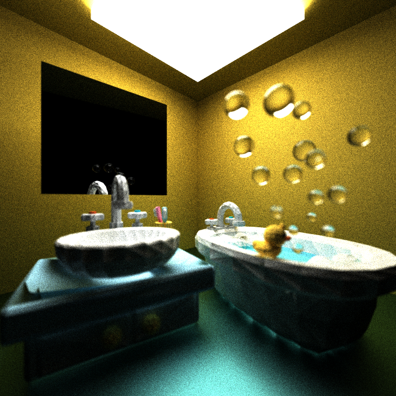||
|:--:|:--:|
|**The Lonely Bathroom**|**The Neon Bathroom**|

The only difference between the two images is that the walls of the first one uses a microfacet material:
```json
"wall":
{
    "TYPE":"Microfacet",
    "RGB":[0.99215686, 0.82352941, 0.28235294],
    "SPEC_RGB":[1.0, 1.0, 1.0],
    "ROUGHNESS": 0.8,
    "IOR": 1.5
}
```
whereas those of the second one uses a light material:
```json
"wall":
{
    "TYPE":"Emitting",
    "RGB":[0.99215686, 0.82352941, 0.28235294],
    "EMITTANCE":1.0
}
```
For the rest of the scene, the both the ceiling and the floor use microfacet materials. The mesh (the sink and the bathtub) is loaded from a .glb file with its default textures and uses a diffuse material. The bubbles are dielectrics with index of refraction 1.33. Furthermore, we have a big white light hanging on the ceiling and a mirror on the left wall. Additionally, the depth of field (DOF) effect can be seen at the blurrred bubbles.

# Build Instructions
Before running, please unzip the `mesh_loader.zip` file in the `src` folder.

# Basic Features
## Simple BRDFs
Both images are generated after 1000 iterations.

### Diffuse
A diffse material should be define in json like this:
```json
"diffuse_white": 
{
  "TYPE":"Diffuse",
  "RGB":[0.98, 0.98, 0.98]
}
```

Below is the image of the default Cornell box scene with a diffuse material. 

||
|:--:|
|**Diffuse Material**|

The average time for each frame is 500 ms and the FPS is 2.0.

### Mirror
A mirror material should be define in json like this:
```json
"mirror": 
{
  "TYPE": "Mirror",
  "SPEC_RGB": [1.0,1.0,1.0]
}
```

Below is the image of the default Cornell box scene with a mirror material.

||
|:--:|
|**Mirror Material**|

The average time for each frame is 533.5 ms and the FPS is 1.9.

### *Blooper*: Dark Ring for the Mirror Material
This took me so long to debug. At the beginning my mirror material looked like this:
.
I had absolutely no idea why because the feature was so simple. At the end I found out that GLM's reflect uses an inverse version of the original physics equation. The lesson to learn is never take APIs for granted. Always read what they actually do.

## Performance/Visual Improvements
> - The scene file to test **stream compaction** and **matwrial sort** features is in `../scenes/jsons/test_performance/`. Remember to replace the path to the meshes and textures with the absolute path on your machine.
> - The scene file to test **antialiasing** is the default cornell box scene.

For each of the experiments conducted in this section, the number of iterations is set to 500. When testing each feature, the other two features are turned on for faster result generation.

### Stream Compaction
To better analyze the performance improvements brought about by stream compaction in the context of path tracing, we can look at the percentage reduction in rendering times across different scene complexities and triangle counts. This allows us to quantify the efficiency gains more precisely and see how stream compaction scales with scene complexity.


#### Closed Scene Analysis
For the closed scene, stream compaction shows significant improvements as the complexity (triangle count) increases:

- **At 960 triangles**, the reduction in time per frame from 2,414.80 ms without stream compaction to 960.00 ms with stream compaction translates to an improvement of approximately 60.2%.
- **At 5,760 triangles**, the time decreases from 15,877.50 ms to 5,760.00 ms, which is an improvement of about 63.7%.
- **At 23,040 triangles**, there is a reduction from 61,907.50 ms to 24,141.30 ms, resulting in an improvement of approximately 61.0%.

These improvements demonstrate that stream compaction becomes more effective as the number of triangles increases, consistently offering around a 60% decrease in rendering time in closed environments. This consistent performance enhancement underscores the effectiveness of stream compaction in managing ray interactions in denser geometries where rays are likely to remain within the scene longer.

#### Open Scene Analysis
In the open scene, the performance gains from stream compaction are even more pronounced, especially at higher complexities:

- **At 960 triangles**, the time reduction from 568.90 ms without stream compaction to 260.37 ms with stream compaction results in an improvement of approximately 54.2%.
- **At 5,760 triangles**, the time decreases from 14,278.82 ms to 2,863.59 ms, showing an improvement of around 79.9%.
- **At 23,040 triangles**, there is a dramatic reduction from 55,210.47 ms to 9,281.79 ms, which translates to an improvement of approximately 83.2%.

The more substantial percentage improvements in the open scene can be attributed to the higher likelihood of rays escaping or becoming ineffective quickly due to less complex interactions with scene elements. Stream compaction effectively eliminates these non-contributing rays early, thereby significantly reducing computational waste.

#### Conclusion
Overall, stream compaction offers substantial performance enhancements, particularly in open scenes where many rays do not significantly interact with the scene elements. The technique is highly scalable, showing greater benefits as the number of triangles and scene complexity increase. By focusing computational resources on rays that significantly contribute to the final image, stream compaction makes path tracing more efficient and viable for complex scenes, particularly in real-time applications.

### Sorting Paths by Material


The performance chart provided indicates the impact of material sorting on the rendering time of scenes at various levels of complexity, measured by triangle counts. Material sorting is a technique used in path tracing to optimize the shading step by making rays, path segments, or intersections contiguous in memory by material type. This strategy aims to streamline the computation process during the shading phase by grouping similar materials together, potentially reducing the overhead associated with switching between different material types.

#### Performance Improvements Quantified

From the data provided in the chart:
- **At 960 triangles**, the rendering time with material sort is 2,414.80 ms compared to 2,324.50 ms without material sort, showing a slight increase in time by about 3.9%. This indicates that at lower complexities, the overhead of sorting may not be justified by the performance gains in shading.
- **At 5,760 triangles**, the time with material sort is 11,202.00 ms compared to 11,536.40 ms without material sort, resulting in a performance improvement of about 2.9%. As the scene complexity increases, material sorting starts to show benefits, likely due to more significant material diversity and the increasing impact of efficient shading.
- **At 23,040 triangles**, the time with material sort is 24,141.30 ms compared to 32,292.10 ms without material sort, which translates to a significant improvement of about 25.2%. At this level of complexity, the benefits of material sorting are most pronounced, likely due to a large variety of materials that can cause more severe computational overhead when not sorted.

#### Analysis

The results demonstrate that material sorting can lead to significant performance improvements, especially in more complex scenes with a higher variety of materials. The minor performance degradation observed in very simple scenes suggests that the overhead of sorting might not always be beneficial when the material complexity and diversity are low. However, as the complexity increases, material sorting effectively reduces the time taken per frame by improving the efficiency of BSDF evaluations during shading, making it a worthwhile optimization for complex, material-diverse scenes in path tracing. This approach aligns well with optimizations aimed at reducing divergence in GPU computations and enhancing memory access patterns, which are crucial for achieving high performance in graphics rendering.

### Antialiasing
Below are the images showcasing the antialiasing feature. Both images are rendered with 500 iterations.

|||
|:--:|:--:|
|**With Antialiasing**|**Without Antialiasing**|

|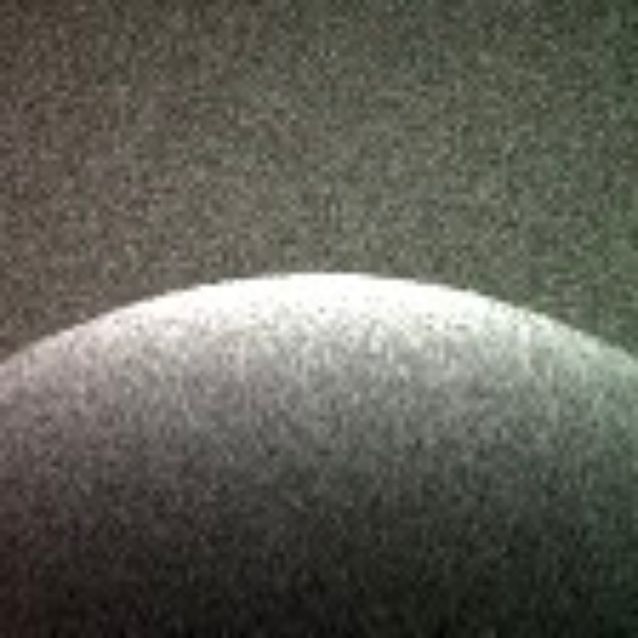|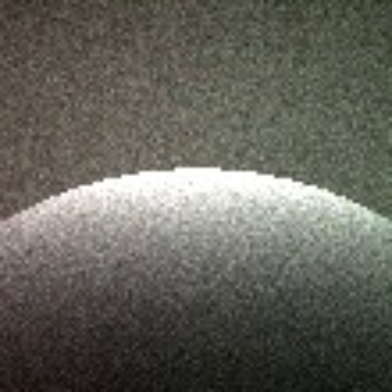|
|:--:|:--:|
|**Zoom With Antialiasing**|**Zoom Without Antialiasing**|

We can see that with antialiasing, the edges of the objects are smoother and the image is less noisy. Given that this feature is implemented by jittering the rays once when the camera is generating them, it does not add much overhead to the rendering process. The average time for each frame is around 550 ms with and without antialiasing. The FPS is 2.0 for both cases.

# Advanced Features
## Visual Improvements
All visual improvements closely follow the theories in *Physically Based Rendering:From Theory To Implementation (PBRT)*.

### Dielectric (Refraction)
To use a dielectric material, the following json should be defined in the scene file:
```json
"dielectric_white": 
{
  "TYPE": "Dielectric",
  "SPEC_RGB": [1.0,1.0,1.0],
  "IOR": 1.5
}
```
where `SPEC_RGB` is the colour of the material and `IOR` is the index of refraction.

The following image is rendered using the scene file `./scenes/jsons/test_materials/cornell_dielectrics__diffSpecCol.json`. The `IOR` is 1.5 for all spheres.

|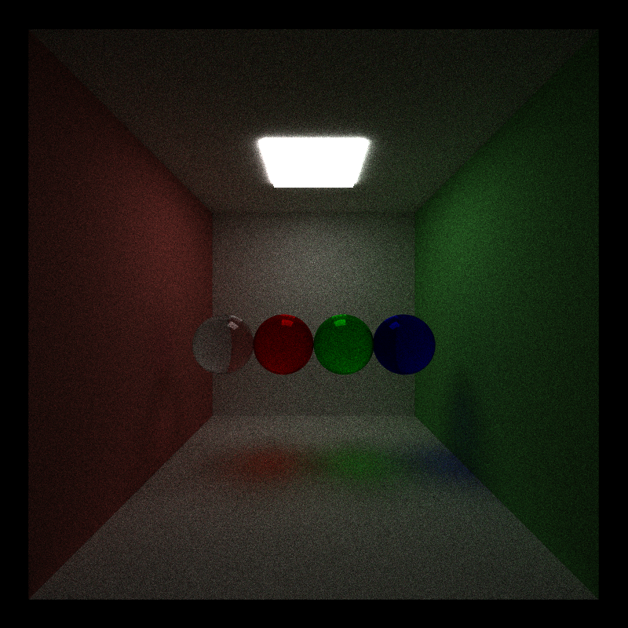|
|:--:|
|**Dielectric Material with Different SPEC_RGB**|

The following image is rendered using the scene file `./scenes/jsons/test_materials/cornell_dielectrics__diffIOR.json`. The `IOR` used from the leftmost sphere to the rightmost one are 1.2, 1.4, 1.6, and 1.8.

|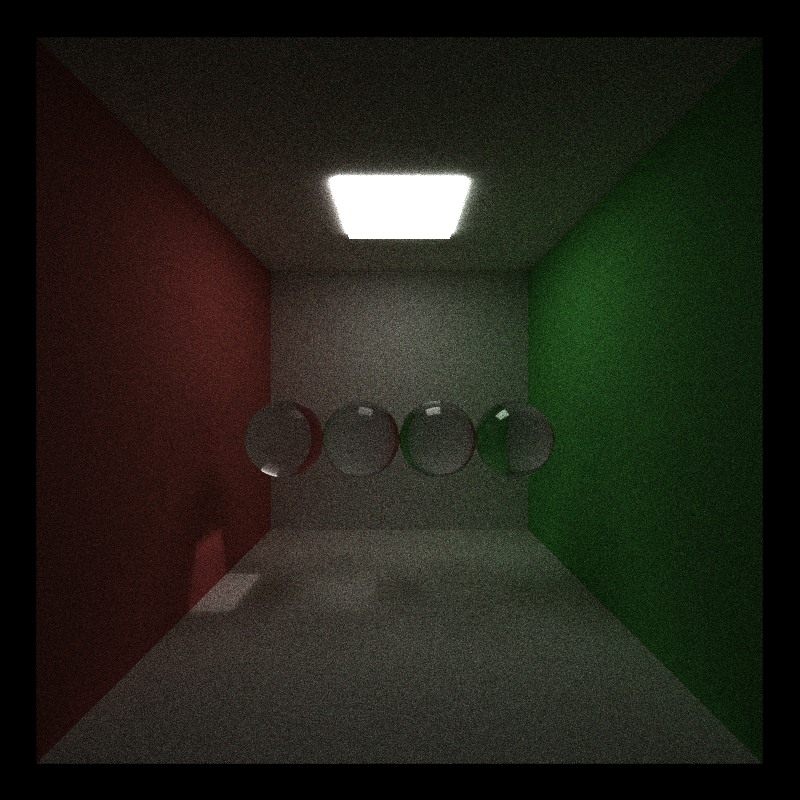|
|:--:|
|**Dielectric Material with Different IOR**|

### Microfacet Material
To use a microfacet material, the following json should be defined in the scene file:
```json
"microfacet": 
{
  "TYPE": "Microfacet",
  "RGB": [0.5,0.5,0.5],
  "SPEC_RGB": [1.0,1.0,1.0],
  "ROUGHNESS": 0.6,
  "IOR": 1.5
}
```

The following image is rendered using the scene file `./scenes/jsons/test_materials/cornell_microfacets.json`. The `ROUGHNESS` used from the leftmost sphere to the rightmost one are 0.01, 0.3, 0.6, and 0.9.

|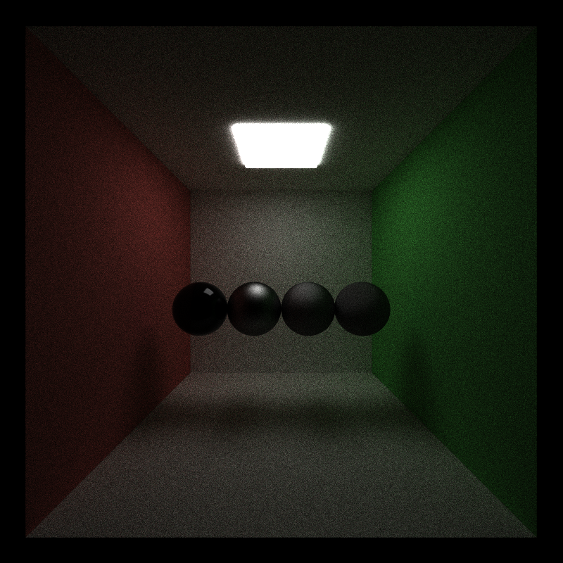|
|:--:|
|**Microfacet Material with Different Roughness**|

We can see that as the roughness increases, the reflection becomes more diffuse.

### Depth of Field (DOF)
To enable DOF, the following properties should be defined for the camera in the scene file:
```json
"FOCAL_DISTANCE": 4.0,
"LENS_RADIUS": 0.4
```

Below are the images rendered using the scene file `./scenes/jsons/test_dof/cornell.json`.

The set of images below vary the `FOCAL_DISTANCE` from 2.0 to 8.0 with a fixed `LENS_RADIUS` of 0.2.

|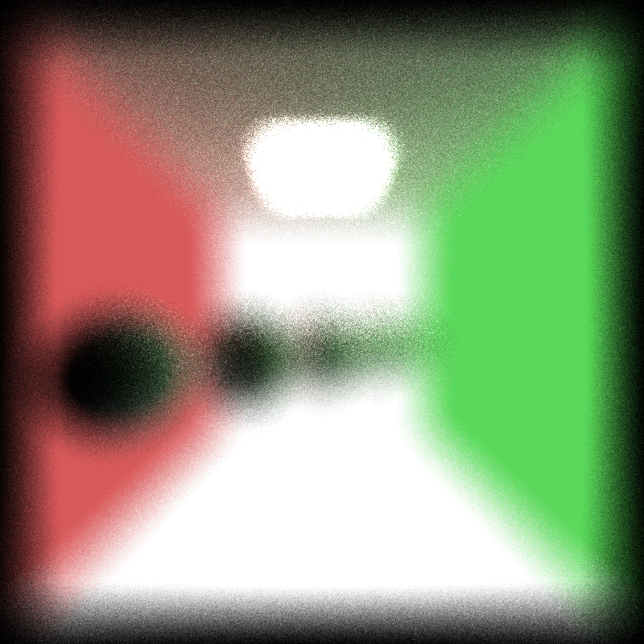||
|:--:|:--:|
|**Radius 0.2, Distance 2.0**|**Radius 0.2, Distance 4.0**|

||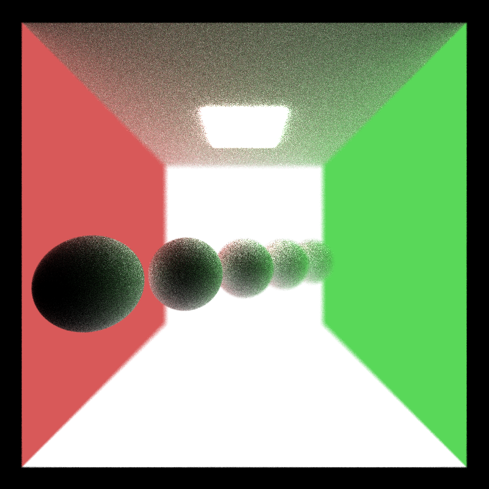|
|:--:|:--:|
|**Radius 0.2, Distance 6.0**|**Radius 0.2, Distance 8.0**|

The set of images below vary the `LENS_RADIUS` from 0.1 to 0.4 with a fixed `FOCAL_DISTANCE` of 4.0.

|||
|:--:|:--:|
|**Radius 0.1, Distance 4.0**|**Radius 0.2, Distance 4.0**|

||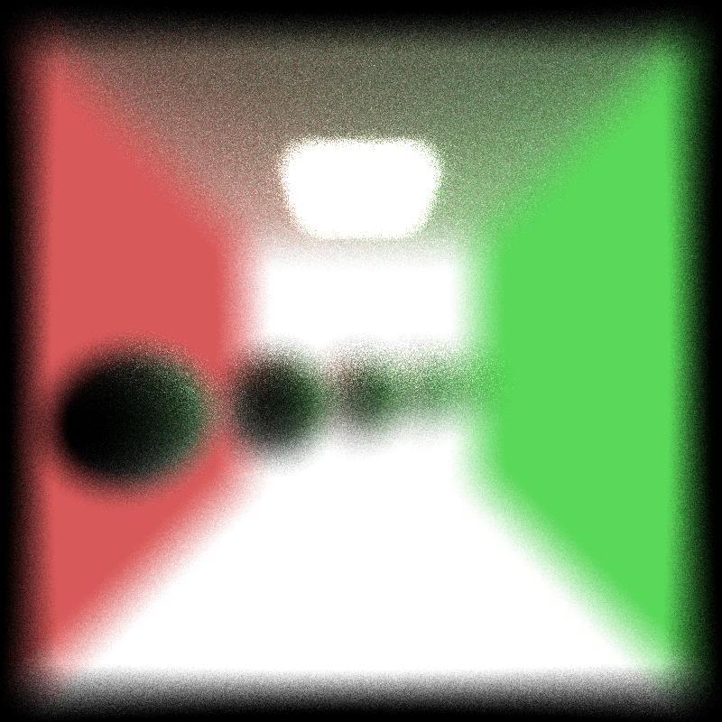|
|:--:|:--:|
|**Radius 0.3, Distance 4.0**|**Radius 0.4, Distance 4.0**|

### Texture Loading with Arbitrary Mesh
The cover image is a good example of texture loading. A simple procedural texture `checkerboard` is also implemented in `pathtrace.cu`. You can toggle this texture by setting `USE_CHECKERBOARD_TEXTURE` on top of the file.

Below is the cover image rendered with the checkerboard texture.
|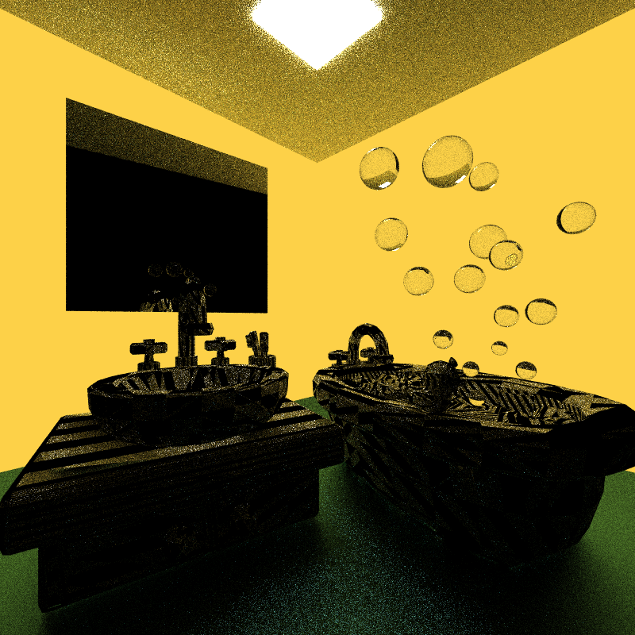|
|:--:|
|**The Neon Bathroom with Checkerboard Texture**|

To use this feature, you must provide a mesh with UV coordinates. There are two ways of loading a mesh with textures. 
The first way is to define a textures like so in the scene file:
```json
"Textures": {
  "albedo":
  {
      "TYPE":"Albedo",
      "TEXTURE_PATH":"{absolute_path_to_texture}"
  },
  "bump":
  {
      "TYPE":"Bump",
      "TEXTURE_PATH":"{absolute_path_to_texture}"
  }
}
```
and to use a texture, you need to set it when you are defining your geometry:
```json
{
  "TYPE":"mesh",
  "MESH_PATH":"{absolute_path_to_mesh}",
  "MATERIAL":"mirror",
  "TEXTURES": ["albedo", "bump"],
  "TRANS":[0.0,5.0,0.0],
  "ROTAT":[0.0,0.0, 0.0],
  "SCALE":[1.0,1.0,1.0]
}
```
And this is the default way of loading textures. The second way is simply load a `.glb/gltf` file and its textures will be read and used. To toggle between the features, set the `USE_SELF_LOADED_TEXTURES` on top of the `scene.cpp` file.

#### Analysis of Performance Impact


**At 960 Triangles:**
- **With Texture Loading:** The time per frame is 3,016.80 milliseconds.
- **With Checkerboard:** The time per frame is 2,988.54 milliseconds.
- **Performance Improvement:** The checkerboard procedural texture shows a slight improvement of about 0.94% compared to traditional texture loading. At this low complexity, the difference is minimal, suggesting that both methods handle low triangle counts with almost equal efficiency.

**At 5,760 Triangles:**
- **With Texture Loading:** The time per frame is 15,186.63 milliseconds.
- **With Checkerboard:** The time per frame is 14,357.98 milliseconds.
- **Performance Improvement:** At this intermediate level of complexity, using a procedural checkerboard texture improves performance by about 5.45%. This more noticeable improvement can be attributed to the procedural method's efficiency in memory usage and possibly less overhead in fetching and applying texture data compared to file-based textures.

**At 23,040 Triangles:**
- **With Texture Loading:** The time per frame is 35,450.50 milliseconds.
- **With Checkerboard:** The time per frame is 30,036.50 milliseconds.
- **Performance Improvement:** Here, the procedural checkerboard texture offers a significant performance enhancement of about 15.27%. As the scene complexity increases, the benefits of using a procedural texture become more pronounced. This improvement is likely due to the reduced computational overhead of procedural textures, which do not require reading from external files and can be generated on-the-fly, thereby reducing memory bandwidth and storage requirements.

##### Conclusions Drawn from the Data

The data illustrates that procedural texture generation, like a checkerboard pattern, tends to offer better performance as scene complexity increases. This is because procedural textures are computed mathematically at runtime and typically require less memory and computational resources than traditional textures, which need to be loaded from disk, stored in memory, and then mapped onto surfaces.

The performance gains are relatively small at lower triangle counts but become significantly more noticeable as the complexity of the scene increases. This trend suggests that for applications where high scene complexity coincides with intensive texture use, procedural textures can offer substantial performance benefits.

In contrast, traditional texture loading might still be preferred in scenarios where unique and complex texture details are required, and the slightly higher computational cost is justifiable by the visual output quality. However, for applications requiring high performance and scalability, especially in real-time systems, procedural textures offer a compelling advantage.

The choice between procedural texture generation and traditional texture loading should consider both the visual fidelity required and the performance implications, as demonstrated by the observed improvements in rendering times across varying levels of scene complexity.

## Mesh Loading
This project supports .obj/.gltf/.glb file loading. I read the data from the files using tinyobjloader and tinygltf. 

Please feel free to play around with the final scene.

## Performance
### Russian Roulette
This feature can be turned on by setting `USE_RUSSIAN_ROULETTE` on top of the `pathtrace.cu` file. 

The data is collected from the scene file `./scenes/jsons/test_performance/russianRoulette.json`. 


**At 960 Triangles:**
- **Without Russian Roulette:** The time per frame is 2,583.36 milliseconds.
- **With Russian Roulette:** The time per frame is 2,315.71 milliseconds.
- **Performance Improvement:** Implementing Russian Roulette shows a reduction in rendering time of about 10.36%. At lower complexities, even though the absolute time saved is modest, the proportional improvement indicates that Russian Roulette effectively reduces unnecessary computations for rays that contribute minimally to the scene.

**At 5,760 Triangles:**
- **Without Russian Roulette:** The time per frame is 13,921.02 milliseconds.
- **With Russian Roulette:** The time per frame is 11,564.03 milliseconds.
- **Performance Improvement:** The use of Russian Roulette offers a more substantial performance improvement of 16.93% at this level of complexity. This suggests that as the number of interactions (due to more triangles) increases, the potential for terminating low-contributing rays becomes more impactful, thereby saving more computational time.

**At 23,040 Triangles:**
- **Without Russian Roulette:** The time per frame is 38,008.78 milliseconds.
- **With Russian Roulette:** The time per frame is 24,141.30 milliseconds.
- **Performance Improvement:** The improvement is the most pronounced at this high complexity level, with a reduction in rendering time of 36.47%. This large improvement underscores the efficiency of Russian Roulette in managing path lifetimes in highly complex scenes, where many rays might otherwise perform unnecessary calculations.

#### Conclusion

The data highlights that Russian Roulette is particularly effective in reducing rendering times as the scene complexity increases. The technique's probabilistic termination of less significant rays becomes increasingly beneficial with the complexity of the scene because there are more opportunities to eliminate computationally expensive paths that have little impact on the final image. 

- **Low Complexity Scenes:** At lower triangle counts, the performance gains are noticeable and beneficial for applications where even small performance enhancements are valuable.
- **Moderate Complexity Scenes:** As the triangle count and scene complexity increase, the benefits of Russian Roulette grow, making it highly suitable for more detailed scenes that are not at the peak of complexity but still require significant computation.
- **High Complexity Scenes:** In very complex scenes, Russian Roulette can drastically reduce computational load, making it an essential technique for optimizing performance in high-detail or dynamic lighting conditions where path tracing traditionally suffers from high computational costs.

The consistent increase in performance improvement across triangle counts provides a compelling case for the adoption of Russian Roulette in rendering scenarios where path optimization can lead to significant reductions in computational overhead and faster rendering times, without compromising on visual fidelity. This technique is especially relevant in real-time rendering applications and complex animation scenes where rendering speed is crucial.


### Buggy BVH
I intended to implement BVH but somehow when a ray traverses to the leaf node of the tree, it does not detect any triangles inside it. Although it's way faster than the naive approach, it's not working properly. The result looks like this:
||
|:--:|
|**BVH not Detecting Triangles in Leaves**|


I tried to render a scene to see the leaf ndoes and here's what I got:
|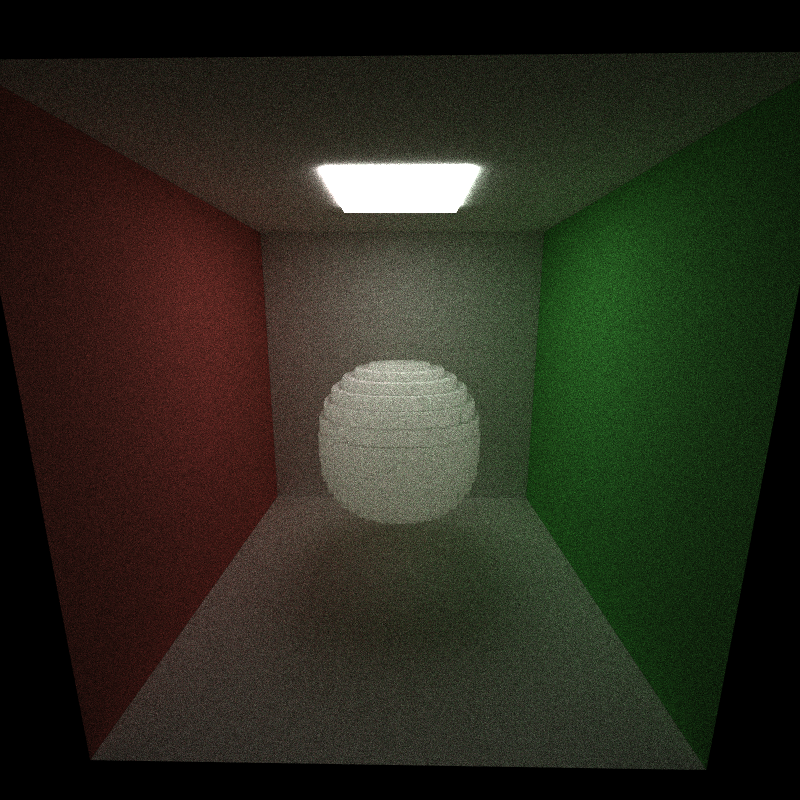|
|:--:|
|**BVH Leaf Node Boxes**|

It looks like the BVH is able to detect the boxes but there are no triangles within. I am not quite sure what I've done wrong. Please take at look at my `bvh.h` and `bvh.cpp` files, and the `meshIntersectionTestBVH` function in `pathtrace.cu` to see if it's worth any credits. Much more importantly, please let me know what I've done wrong if you have any ideas.

Thank you very much!

# Recources
- [Meshes Used in the Cover Image](https://poly.pizza/bundle/Bubbly-Bathroom-Set-eSvpFVB4Ft)
- [TinyObjLoader](https://github.com/tinyobjloader/tinyobjloader)
- [TinyGLTF](https://github.com/syoyo/tinygltf)
- [PBRT](https://pbr-book.org/)


