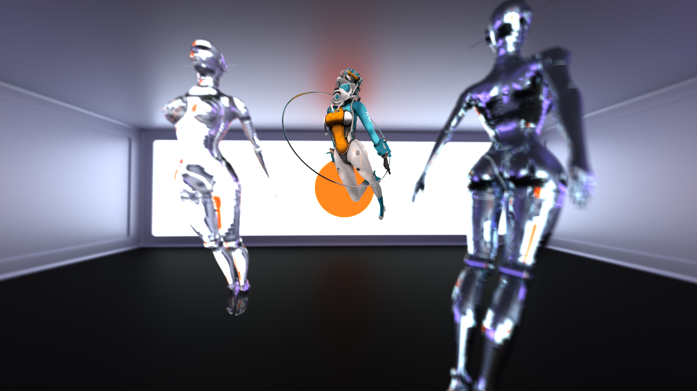
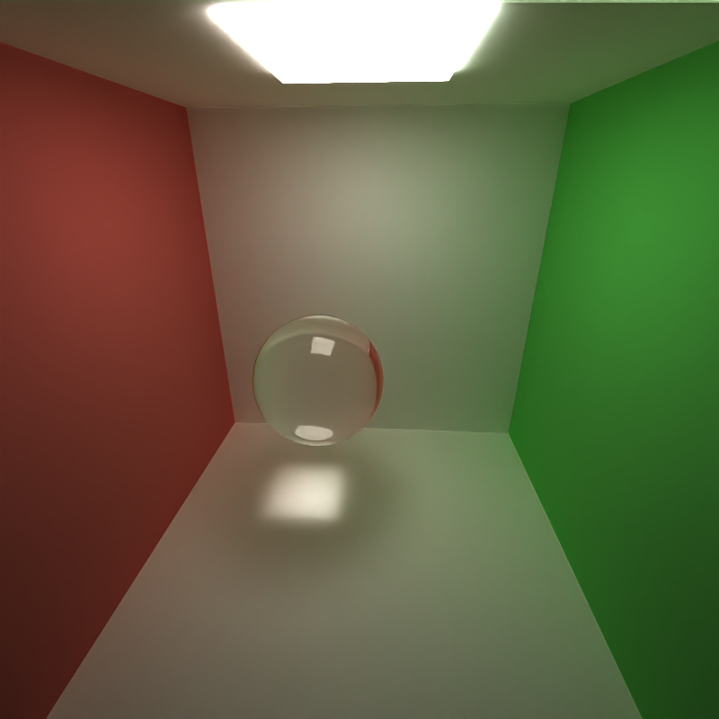
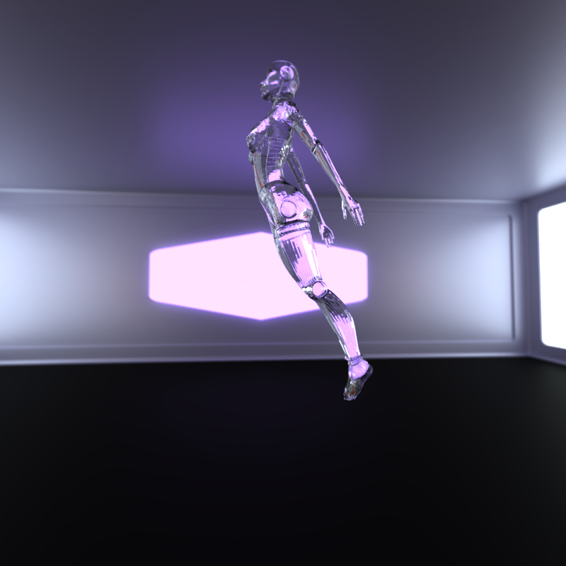

CUDA Path Tracer
================

**University of Pennsylvania, CIS 565: GPU Programming and Architecture, Project 3**

* Zixiao Wang
  * [LinkedIn](https://www.linkedin.com/in/zixiao-wang-826a5a255/)
* Tested and rendered on: Windows 11, i7-12800H @ 2.40 GHz 32GB, GTX 3070TI (Laptop)

## Showcase Image (1920 * 1080)

## Introduction

In this project, I implement a CUDA-based path tracer capable of rendering globally illuminated images quickly. The core renderer includes a shading kernel with BSDF evaluation for Ideal diffuse, perfectly specular-reflective, combination of refraction and reflection, and imperfect specular surface incorporated with roughness parameters. Further, it also explores the features of OBJ and Texture loading, Depth of Field, Environment Mapping/Lighting, BVH structure, and Denoising. The Sections below each specify the output and implementation of each feature, including performance analysis of optimization and further development direction.

## BRDF Shading (Bidirectional Reflectance Distribution Function shading)

### Ideal diffuse shading: The image shows basic Lambertian shading in the Cornell box scene

 

### Ideal Specular Shading： The image shows perfect specular surface shading in the Cornell box scene

### Imperfect reflection: below are 4 images incorporated with different roughness. The edge of the reflection image becomes more and more blur while roughness increases. Implementation reference [ PBRTv4 9.3 ](https://pbr-book.org/4ed/Reflection_Models/Specular_Reflection_and_Transmission)
* Top left is roughness 0.0 (the light is dim because the light parameter is about 0.3 less, but it does not affect the roughness effect)
* Top right is roughness 0.3
* Low left is roughness 0.6
* Low right is roughness 0.9

   

### Refraction and Reflection: Refraction with Fresnel effects using [Schlick's approximation](https://en.wikipedia.org/wiki/Schlick's_approximation). Implementation Reference [PBRTv4 9.3](https://pbr-book.org/4ed/Reflection_Models/Specular_Reflection_and_Transmission)
* In the real world, reflection and refraction might happen at the same time in one spot. But here, we sample one pixel with 600 samples. Then, for each sample, Monte Carlo was utilized to decide on either refraction or reflection. Once averaged out, it is real.

## Visual Features
### OBJ Mesh Loading and Texture Mapping ([TinyObj](https://github.com/tinyobjloader/tinyobjloader))
* left is final rendering
* middle is albedo (denoised)
* right is normal (denoised)
  
   

### Environment Map Lighting

### BVH accelerated spatial structure
* left is with BVH off, rendering at 4.6 FPS
* right is with BVH on, rendering at 15.5 FPS
* The mesh is about 3896 triangles
* A detailed performance analysis in [later section]()

 

### DOP (Depth of Field), implementation reference [PBRT 5.2.3](https://pbr-book.org/4ed/Cameras_and_Film/Projective_Camera_Models#TheThinLensModelandDepthofField) and [PBRT A.5.2](https://pbr-book.org/4ed/Sampling_Algorithms/Sampling_Multidimensional_Functions#UniformlySamplingHemispheresandSpheres)

* using a thin lens camera model, with "APERTURE": 0.25 and "FOCALDist": 50

 

### Denoise with [intel Open Image Denoise](https://github.com/RenderKit/oidn)
* The left side is without the denoise filter, the right side is with the denoise filter, the image is about 350 samples per pixel
* Prefiltering both [normal buffer](img//cornell.2024-10-04_22-52-44z.350samp.png) and [albedo buffer](img//cornell.2024-10-04_22-51-16z.350samp.png) as auxiliary data, then [feed filtered albedo and normal](https://github.com/RenderKit/oidn?tab=readme-ov-file#denoising-with-prefiltering-c11-api) in with unfiltered image(beauty) buffer
* set hdr as true, so the image color buffer can be higher than 1.

 

## Performance Analysis

###

## Instruction

## Contribution
### Thrid Party Open Source Tools and Code
* TinyOBJ: https://github.com/tinyobjloader/tinyobjloader
* stb: https://github.com/nothings/stb?tab=readme-ov-file, stb_image: https://github.com/nothings/stb/blob/master/stb_image.h
* Intel Open Image Denoise (OIDN): https://github.com/RenderKit/oidn
* BVH tutorial: https://jacco.ompf2.com/2022/04/13/how-to-build-a-bvh-part-1-basics/
* CUDA Texture OBJ: https://developer.download.nvidia.com/cg/tex2D.html; https://docs.nvidia.com/cuda/cuda-runtime-api/group__CUDART__TEXTURE__OBJECT.html; https://forums.developer.nvidia.com/t/read-back-texture-to-host-memory-from-cudatextureobject/247689/2
* DOF and sampling disk: [PBRT 5.2.3](https://pbr-book.org/4ed/Cameras_and_Film/Projective_Camera_Models#TheThinLensModelandDepthofField) , [SampleUniformDiskConcentric()](https://pbr-book.org/4ed/Sampling_Algorithms/Sampling_Multidimensional_Functions.html#SampleUniformDiskConcentric)
* More code implementations can be referenced to [PBRT](https://pbr-book.org/)
### Models
most of the models I used are purchased under a standard license, so I cannot upload them here, if you are interested in them, please use the link below to purchase and support the creators.
* Sci-Fi Scout Girl (SketchFeb): https://sketchfab.com/3d-models/sci-fi-scout-girl-8b5a6902a7974eb1a1d2d3bef6200f06
* K-VRC Lowpoly | Love, Death & Robots (SketchFeb): https://sketchfab.com/3d-models/k-vrc-lowpoly-love-death-robots-457b298b21454df7837edf4073de3d07
* HDRi Studio Lighting 014 (Artstation): https://www.artstation.com/marketplace/p/2NmKb/hdri-studio-lighting-014-for-your-3d-rendering
* Sorayama Statue / The Weeknd / Silver Girl (Artstation) : https://www.artstation.com/marketplace/p/pBz9o/sorayama-statue-the-weeknd-silver-girl-3d-character-fbx-obj-blender-project-cinema-4d-octane-render-project

