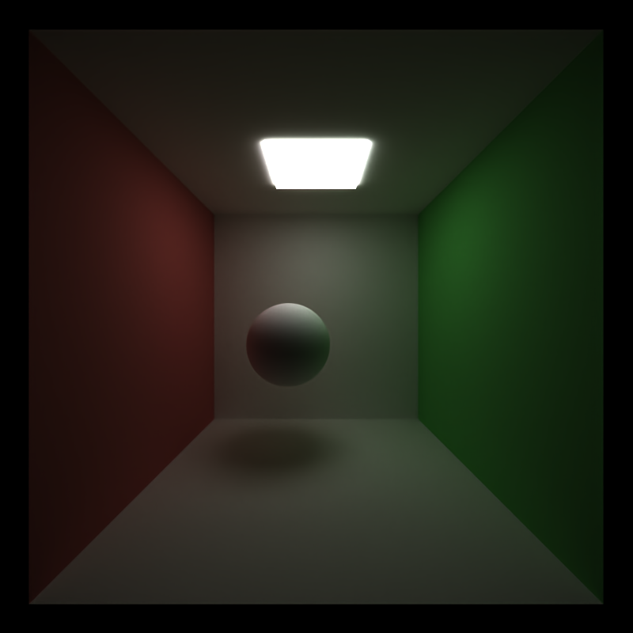
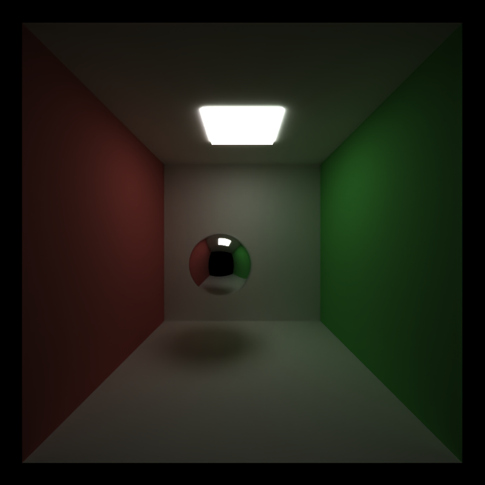
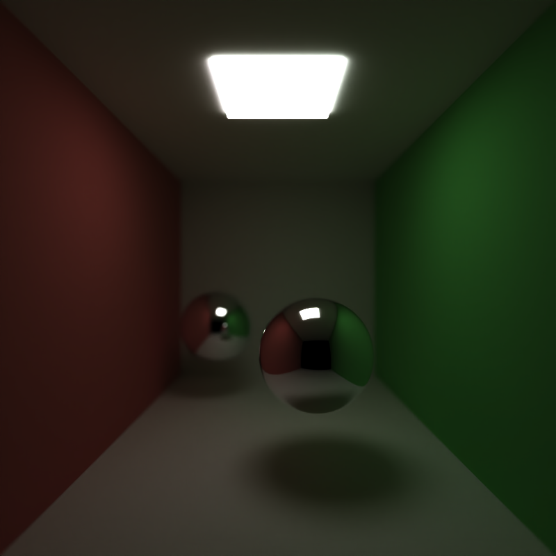
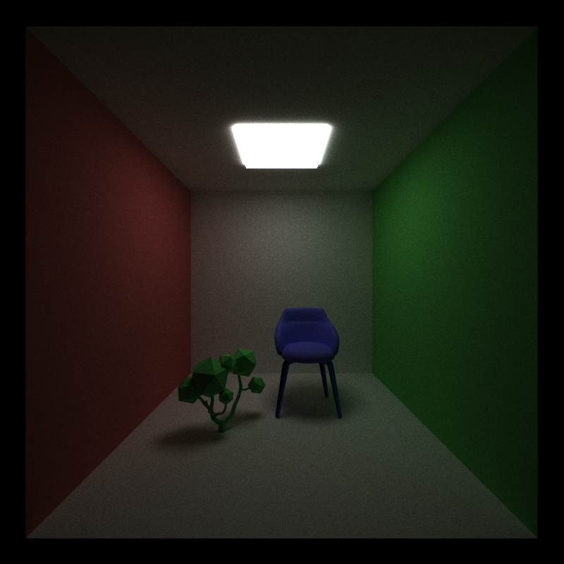

CUDA Path Tracer
================

**University of Pennsylvania, CIS 565: GPU Programming and Architecture, Project 3**

* Kevin Dong
* Tested on: Windows 11, i7-10750H CPU @ 2.60GHz 2.59 GHz, RTX 2060

## Summary
This repository implements a ray tracer using CUDA. A ray tracer simulates the path of light rays as they interact with 
objects in a scene. During the simulation, we first cast rays from the camera into the scene. These rays then interact 
with objects, and we then record whether the ray hits an object. We then use this information to shade the pixel in the 
image. The final rendered output is created by using imGUI.

The path tracer implemented in this repository is capable of simulating the following effects:

### Visual Effects
- Diffusion
- Perfect Specular Reflection
- Stochastic Anti-Aliasing
- Imperfect Specular Reflection
- Refraction with Fresnel Effects
- Depth of Field

### Mesh Loading
- glTF 2.0 loading, using [tinygltf](https://github.com/syoyo/tinygltf)
- obj loading, using [tinyobjloader](https://github.com/tinyobjloader/tinyobjloader)

### Performance Improvements
- Stream Compaction
- Material Sorting
- Russian Roulette Path Termination
- Hierarchical Bounding Volume Hierarchy (BVH)
- Open Image Denoiser AI (OIDN) (Host-side denoising)

Ray tracing is a very complex task with numerous features and optimizations. The functionalities implemented in this 
repository are only a subset of the features available in a full-fledged ray tracer. Besides, due to hardware 
limitations, the performance of the ray tracer is not very impressive. However, we can still clearly see 
performance improvements when we enable certain features.

## Ray Tracing Pipeline
In this section, we will discuss the ray tracing pipeline implemented in this repository.

### Scene Initialization
The scene in this ray tracer is generated in the json format. The json file is then loaded to `scene.h/cpp` where 
materials, cameras, and objects are initialized. The scene is then uploaded to the GPU.

Several types of objects are supported: sphere, cube, and mesh. The mesh object can either be loaded from a glTF file 
or an obj file. If BVH is enabled, the mesh object will be converted to a BVH tree, which will greatly increase the 
traversal process that will be discussed later.

### Ray Generation
In this function, we generate rays from the camera. This is also where we implement stochastic antialiasing and depth 
of field. The rays are then uploaded to the GPU.

### Compute Intersections
In this function, we compute the intersections between the rays and the objects in the scene. We use the BVH tree to 
accelerate the mesh intersection process.

### Shading
In this function, we shade the pixels based on the intersection information. This is where we apply diffuse/specular, 
etc. shading to the pixels.

### Post-Processing
In this part, we perform stream compaction to remove the terminated rays, and we also use Open Image Denoiser AI (OIDN) 
to denoise the image once the ray tracing is done or after a few iterations.

## Visual Outcomes

### Diffusion
Diffusion can also be thought as roughness == 1.0.

### Perfect Specular Reflection

### Imperfect Specular Reflection (Adjustable Roughness)
Setting roughness to be 0.1, 0.5, and 0.9 respectively:

### Refraction with Fresnel Effects
A perfect specular sphere on the left, a glass sphere on the right, and refractive ground:

### Depth of Field

### glTF Mesh Loading

### obj Mesh Loading

### OIDN Denoising

## Performance Analysis
We will now analyze the performance of the ray tracer with different features/optimizations enabled.

### Stream Compaction
For stream compaction, we will compare the performance with and without stream compaction, as well as the performance 
change with different kernel sizes.

### Material Sorting
For material sorting, we will compare the performance with and without material sorting.

### Russian Roulette Path Termination
For Russian Roulette Path Termination, we will compare the performance with and without Russian Roulette Path Termination.

### Hierarchical Bounding Volume Hierarchy (BVH)
For BVH, we will compare the performance with and without BVH.

### Open/Close Scene Comparison
For Open/Close Scene Comparison, we will compare the performance in an enclosed scene and an open scene.

## References
Many of the features were implemented with the help of Physically Based Rendering: From Theory to Implementation (PBRT), 
which includes detailed explanation of many features with pseudocode explanations. Other references include official 
website documentation/guide for libraries or videos/stackOverflow. Here is a detailed list of references:
- [Diffuse/Perfect Specular (PBRTv4 9.2)](https://pbr-book.org/4ed/Reflection_Models/Diffuse_Reflection)
- [Stochastic Anti-Aliasing](https://paulbourke.net/miscellaneous/raytracing/)
- [Imperfect Specular Reflection (PBRTv4 9.3)](https://pbr-book.org/4ed/Reflection_Models/Specular_Reflection_and_Transmission)
- [Refraction with Fresnel Effects (PBRTv4 9.4)](https://pbr-book.org/4ed/Reflection_Models/Specular_Reflection_and_Transmission)
- [Depth of Field (PBRTv4 5.2.3)](https://pbr-book.org/4ed/Cameras_and_Film/Projective_Camera_Models#TheThinLensModelandDepthofField)
- [glTF structure](https://www.slideshare.net/slideshow/gltf-20-reference-guide/78149291#1)
- [sample glTF models](https://github.com/KhronosGroup/glTF-Sample-Models)
- [Russian Roulette (PBRTv4 14.5.4)](https://www.pbr-book.org/3ed-2018/Light_Transport_I_Surface_Reflection/Path_Tracing)
- [BVH (PBRTv4 4.3)](https://pbr-book.org/3ed-2018/Primitives_and_Intersection_Acceleration/Bounding_Volume_Hierarchies#BVHAccel::recursiveBuild)
- [Open Image Denoiser](https://www.openimagedenoise.org/)
- 