CUDA Path Tracer
================

**University of Pennsylvania, CIS 565: GPU Programming and Architecture, Project 3**

* ADITHYA RAJEEV
  * [LinkedIn](https://www.linkedin.com/in/adithyar262/)
* Tested on: Windows 11, i7 13th Gen @ 2.40GHz 16GB, GeForce RTX 4050 8GB (Personal)

### Overview

This project implements a CUDA-based path tracer with various advanced rendering features. The path tracer is capable of simulating complex light interactions in 3D scenes, producing physically-based, photorealistic images.

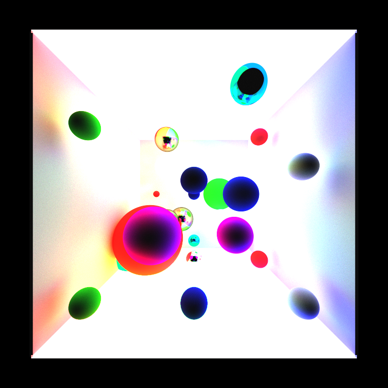

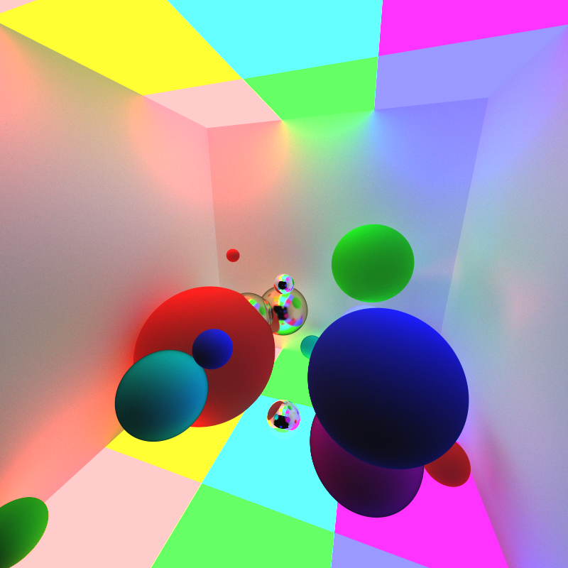

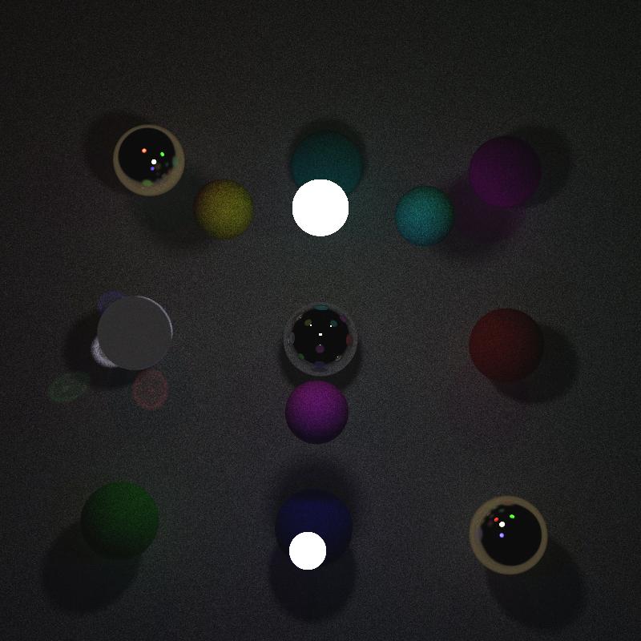

## Features

### Core Functionality

* **BSDF Evaluation**:
  * Ideal diffuse surfaces (Lambertian reflection)

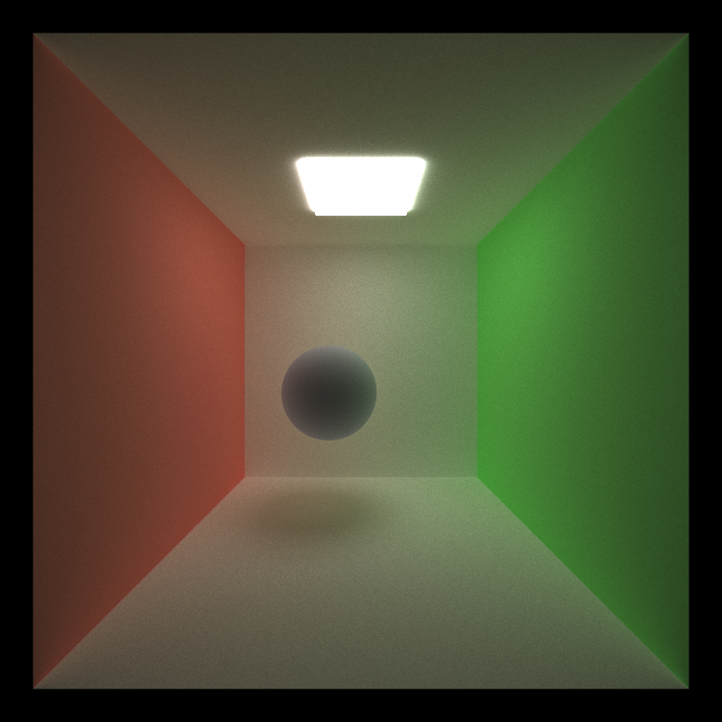

  * Perfectly specular-reflective surfaces (mirrors)

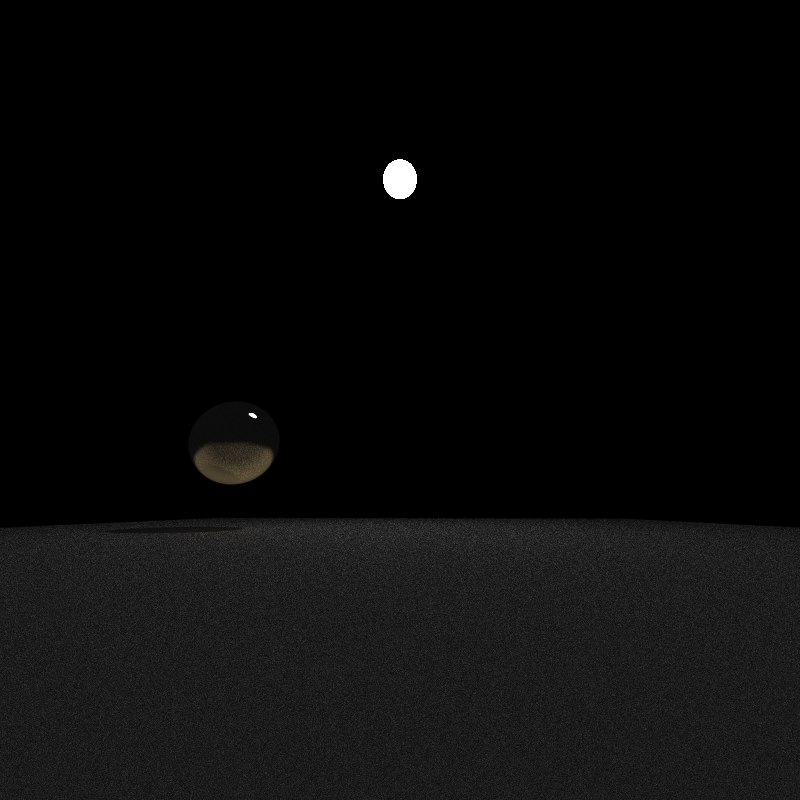

* **Path continuation/termination** using Stream Compaction
* **Material-based ray sorting** for optimized performance

I implemented material sorting for my path segments and intersections before calling the material shading kernel, expecting it to improve performance. 
However, I was surprised to find that this actually made my path tracer slower. Upon reflection, I realized that this might be due to the lack of diversity in my material types. It seems that in my current scene setup, the overhead from sorting is greater than any performance gains from reducing warp divergence. This suggests that the effectiveness of material sorting might depend heavily on the complexity and variety of materials in the scene.

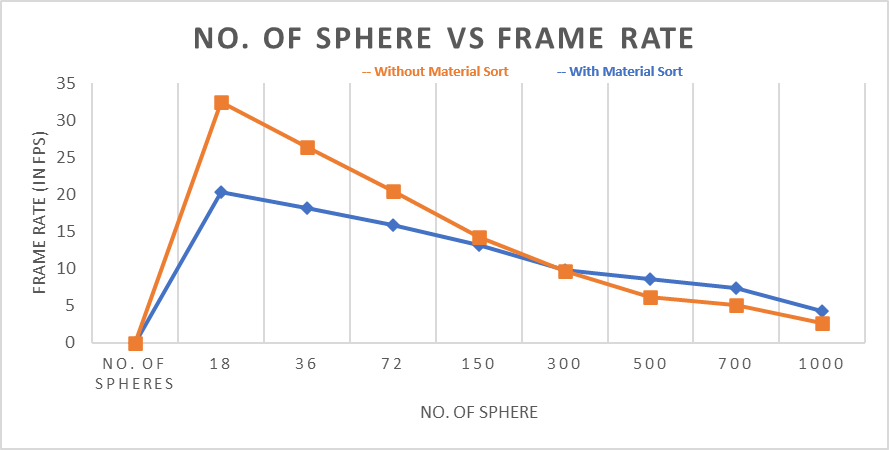

* **Stochastic sampled antialiasing**

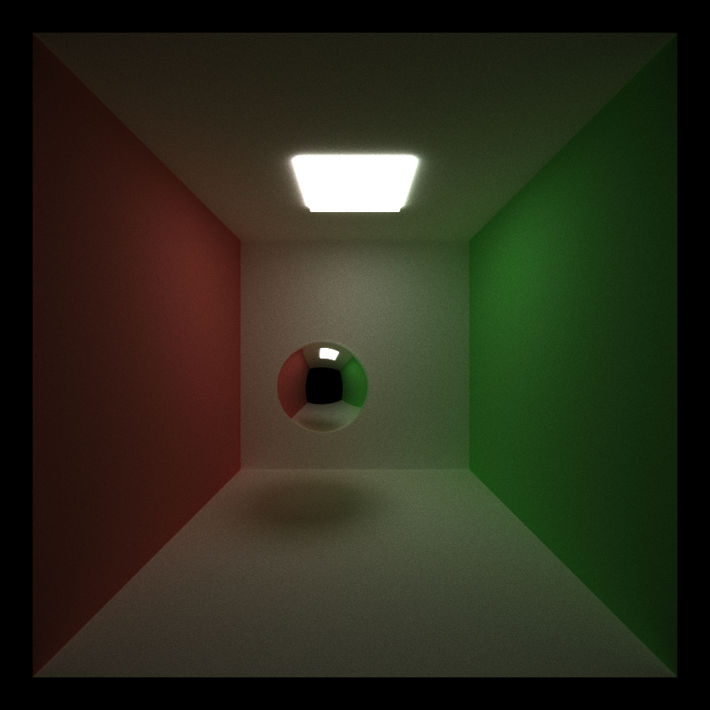

### Advanced Features

* **Refraction** with Fresnel effects (e.g., glass, water)

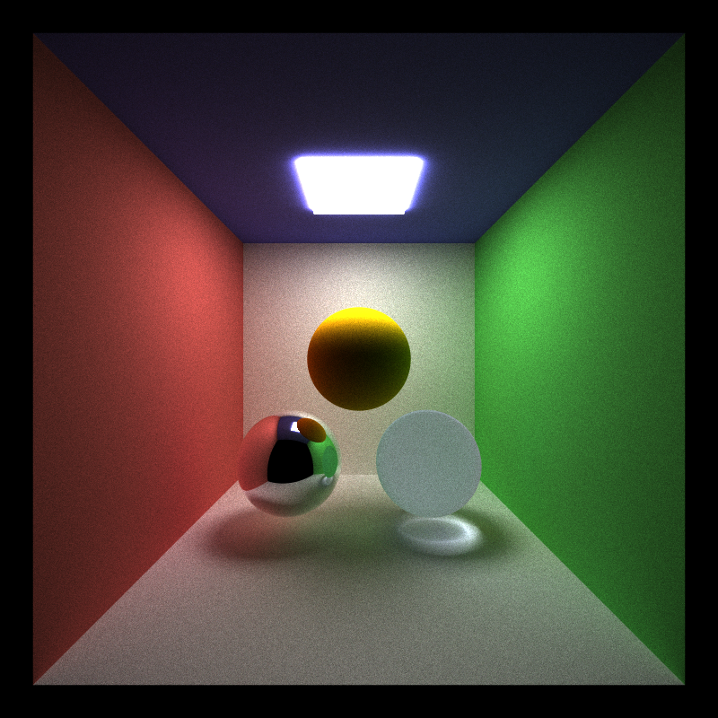

* **Physically-based depth-of-field**

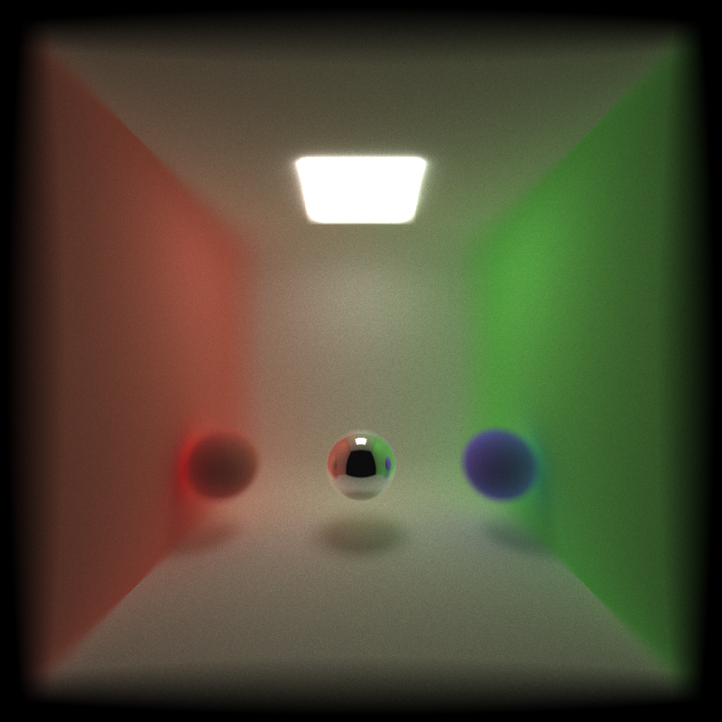

* **Direct lighting simulation**

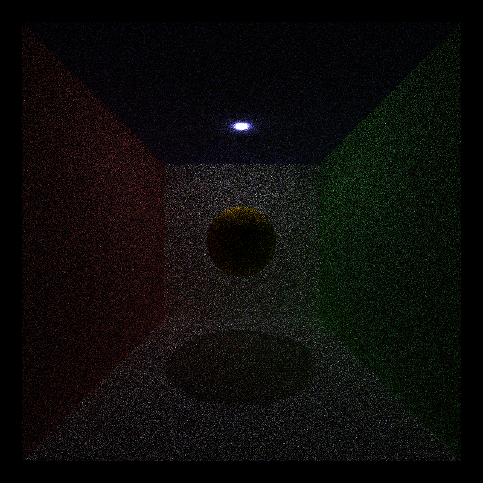

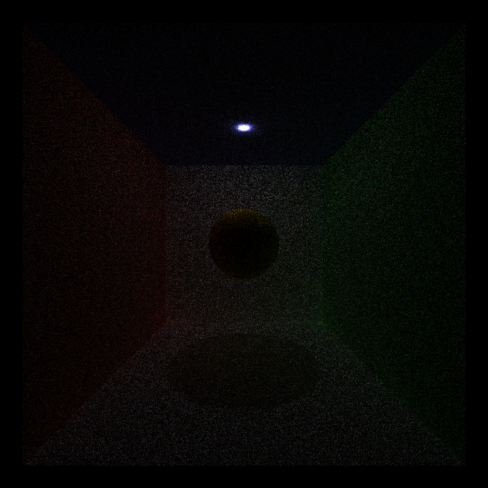

### Russian Roulette Path Termination

Russian Roulette technique was implemented to terminate unimportant paths early. Our analysis shows:

* fps with Russian Roulette Enabled - 43.2 fps
* fps with Russian Roulette Enabled - 34.9 fps
* 23.78% Increase in FPS
* Negligible impact on image quality

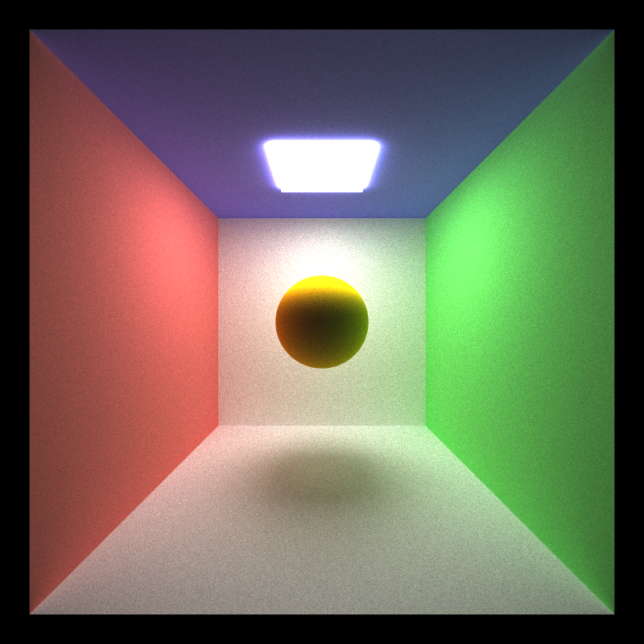

* **Physically-based rendering with Metallic and Platic materials**

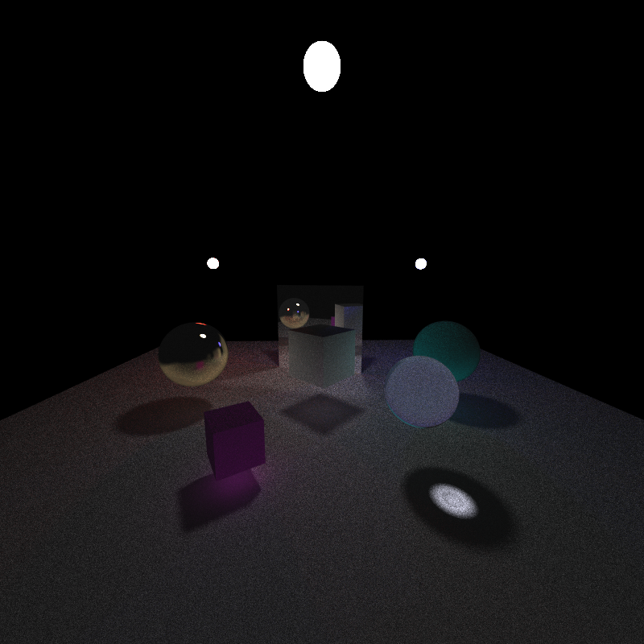

## Bloopers

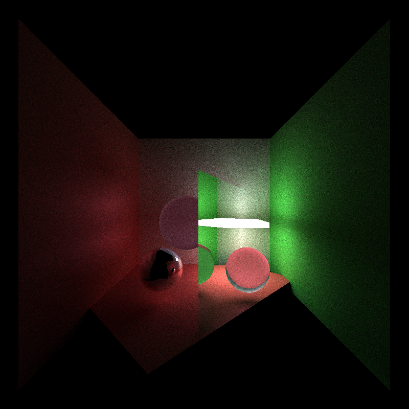

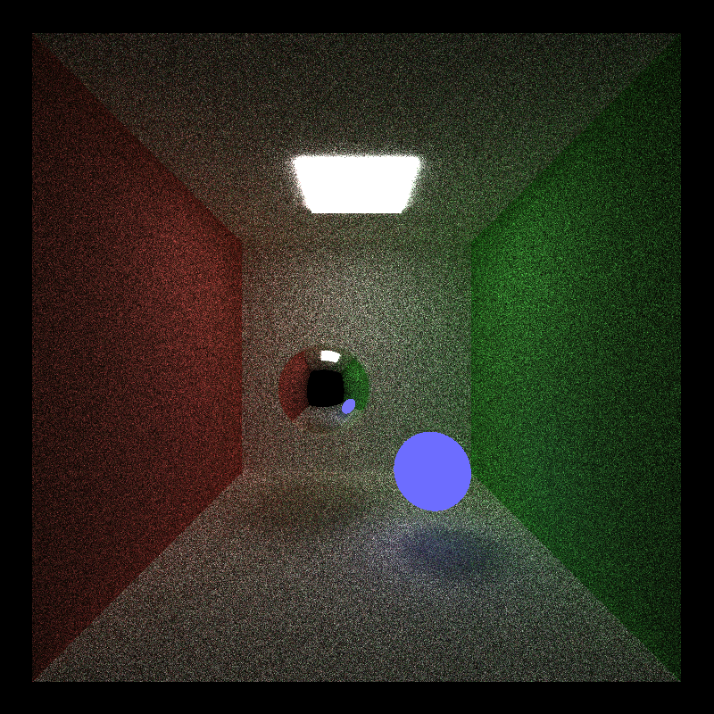

## References

* [PBRT-v3 Book](https://www.pbrt.org/)
* [Physically Based Rendering: From Theory To Implementation](http://www.pbr-book.org/)
* [NVIDIA CUDA Documentation](https://docs.nvidia.com/cuda/)
