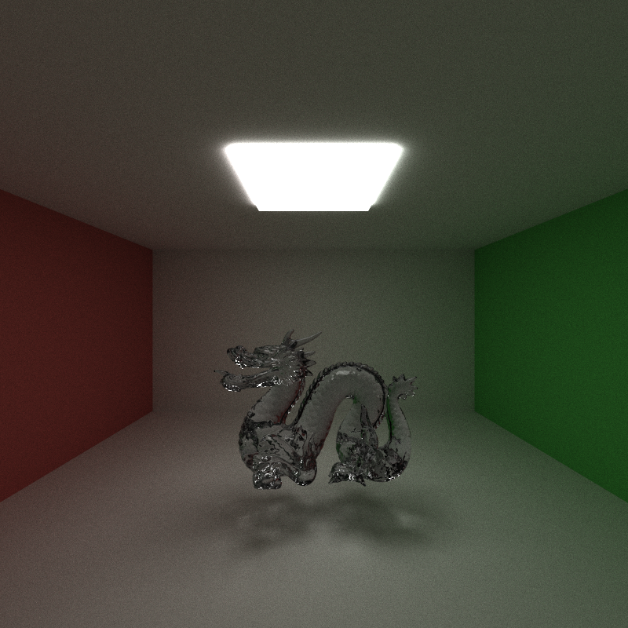
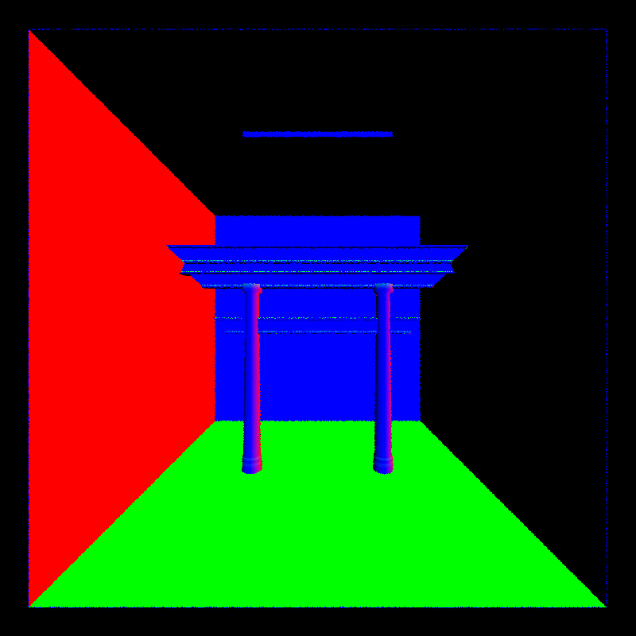
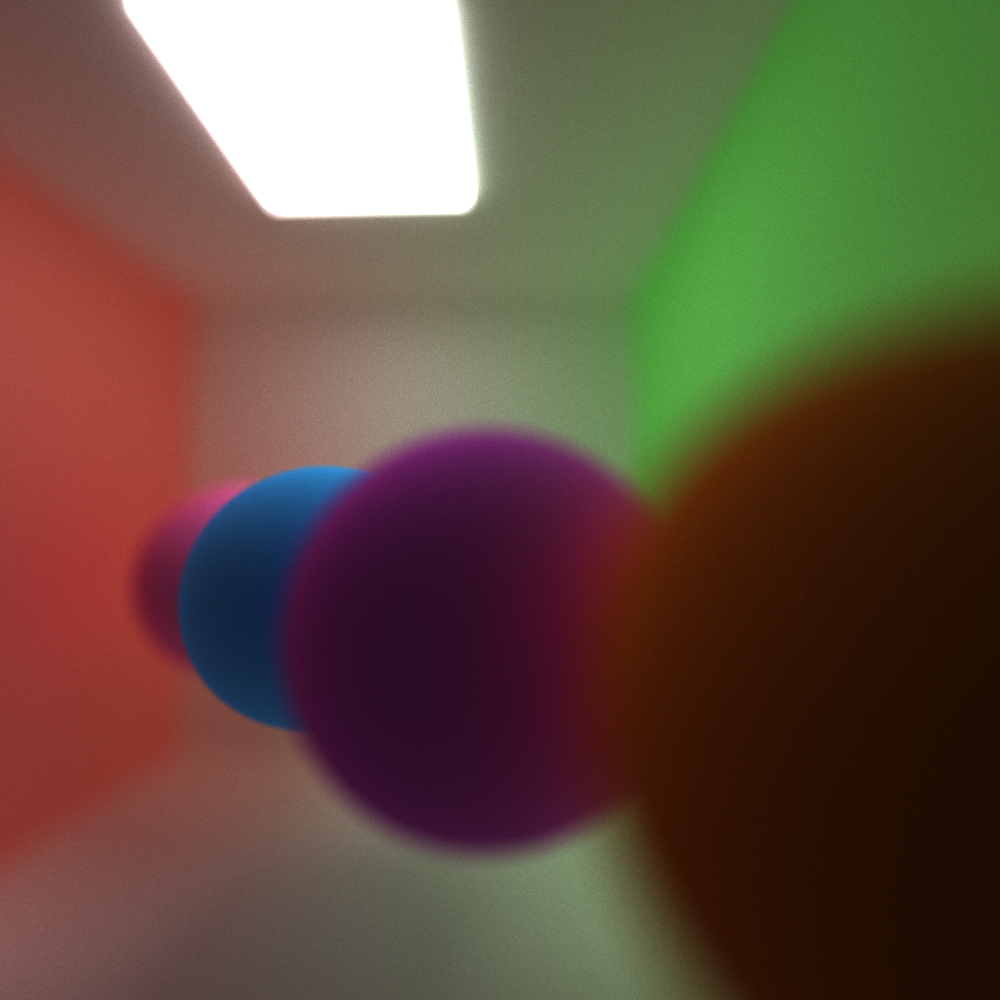
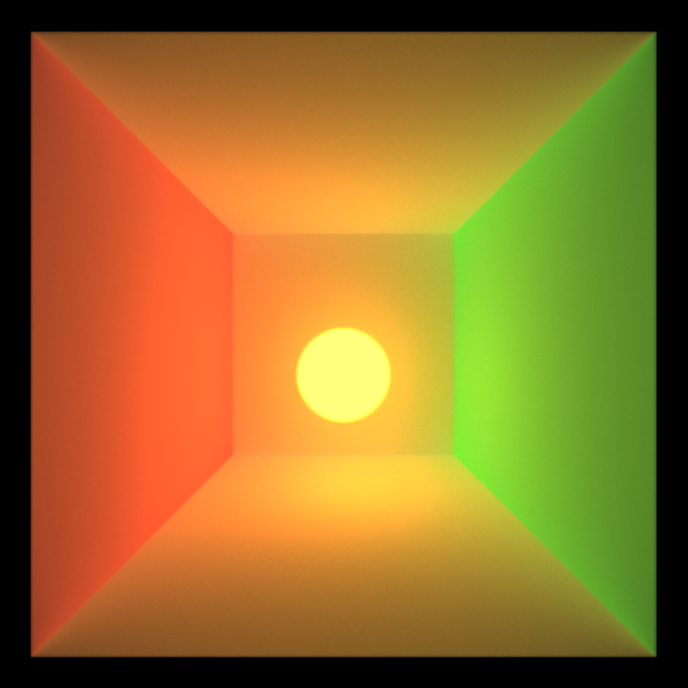
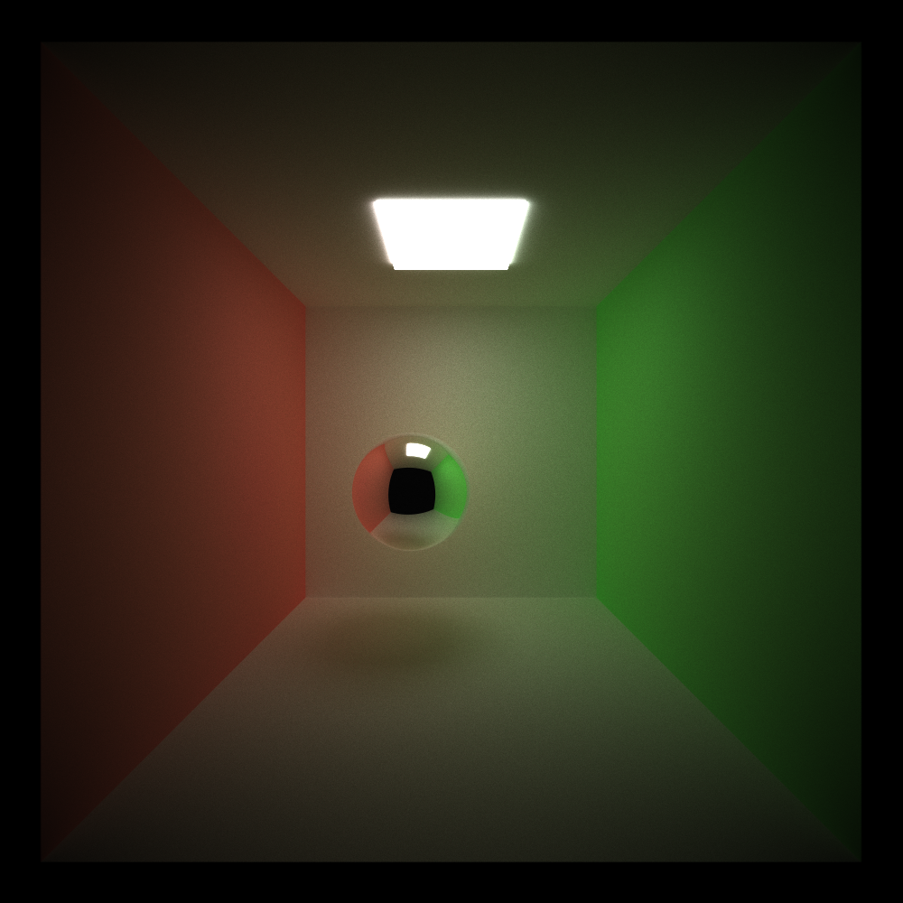
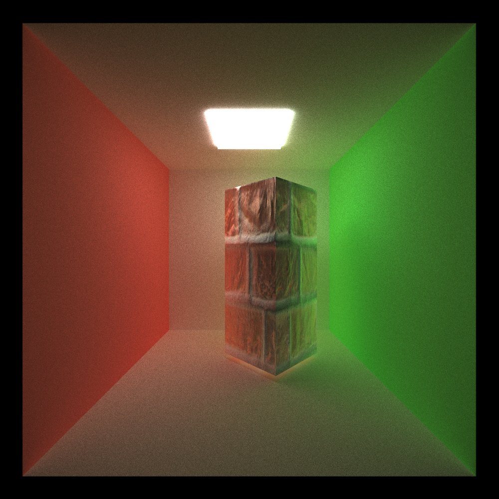
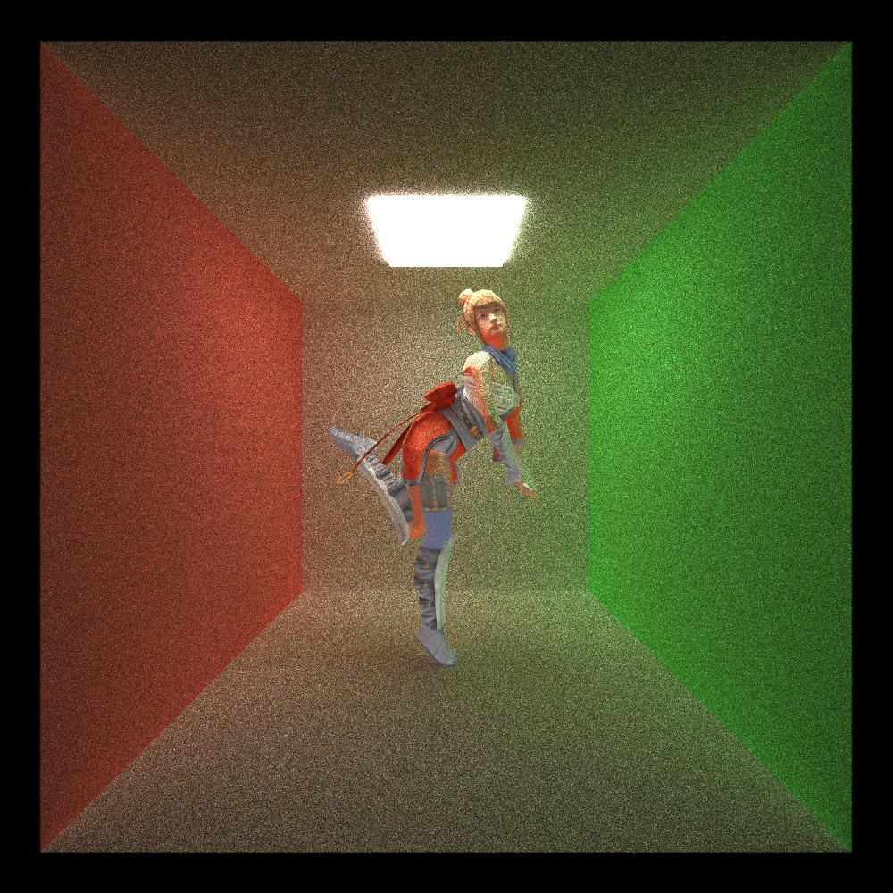

CUDA Path Tracer
================

**University of Pennsylvania, CIS 565: GPU Programming and Architecture, Project 3**

* Yifan Lu
  * [LinkedIn](https://www.linkedin.com/in/yifan-lu-495559231/), [personal website](http://portfolio.samielouse.icu/)
* Tested on: Windows 11, AMD Ryzen 7 5800H 3.20 GHz, Nvidia GeForce RTX 3060 Laptop GPU (Personal Laptop)

## Feature
- Visual Effects
  - Materials
    - Diffuse
    - Specular
    - Refract 
  - Arbitrary Mesh Loading
  - Texture Mapping
  - Depth of Field
  - Environment Mapping
  - Post-Process Effect
    - Bloom
    - Vignette
  - OIDN Denoise
- Optimization
  - Stream Compaction
    - Path Termination
    - Sort By Material
  - Russian Roulette Path Termination

## Introduction

## Visual Effects
### Materials
#### Reflection

#### Refraction

The above image shows the glass ball with IOR 1.5, 2.0, 2.5, 3.0 from left to right, up to down respectively.

This refraction material utilizes both refraction and reflection under Schlick's approximation.

### Environment Map

From left to right, the materials are total reflect, diffuse and refract respectively.

### Arbitrary Mesh Loading and Texture Mapping

### Depth of Field

Depth of field effect shows the physical structure of a camera lens. By toogling lens radius and focal distance, we can get a sharp edge around focal point and adjust the intensity of blur effect.

### Post-Process Effect
#### Bloom Effect

#### Vignette

### OIDN Denoise
The following images shows:
- without denoiser
- with only beauty denoiser
- with beauty + albedo + normal denoiser
  

tested under 1000 samples with denoise interval 10

Our Ninja scene from previous sections. With only 100 samples with denoise interval 10, you can see a clear difference:

## Optimization
### Stream Compaction
#### Path Termination
check ray's remaining bounce after each depth iteration. To achieve better continuity I also terminate ray after intersection test.

However, if the scene contains an environment map, you can not compact after intersection test since we need the missed-hit ray to sample environment map.

#### Sort By Material

### Russian Roulette Path Termination
The idea is to terminate ray bouncing early if the ray meets certain standards.
