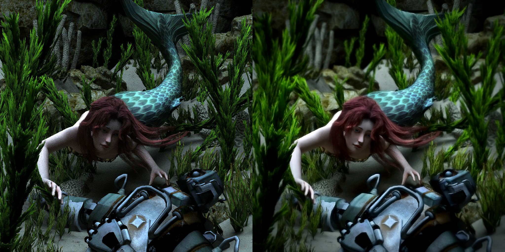

CUDA Path Tracer
================

**University of Pennsylvania, CIS 565: GPU Programming and Architecture, Project 3**

* Deze Lyu
* Developed on: Windows 11, AMD Ryzen 5 5600U @ 2.30GHz 16GB, NVIDIA GeForce MX450 9142MB
* Rendered on: Windows 11, Intel(R) Core(TM) i9-12900F @ 2.40GHz 64GB, NVIDIA GeForce RTX 3090

### Deze Lyu

**Final Rendered Image:**

*"Seek of the Forgotten"* by Deze Lyu

**Final Rendered Image Workflow:**

The scene was constructed in **Maya**, utilizing assets sourced from various online asset stores. Each asset was carefully selected and extensively modified to meet the project's unique design requirements, with approximately $200 invested in asset purchases.

The component images generated alongside the final render include diffuse, normal, material type, reflectivity, and bounding sphere volumes. Note that this path tracer utilizes an experimental, self-developed bounding sphere hierarchy as an acceleration structure. In the final image, this is visualized by the surface normals of the bounding spheres, sorted in reverse order.

The final image was rendered with 800 samples per ray and 32 iterations per sample. After rendering, the image was sent to **Photoshop** for denoising and post-processing.

The path tracer supports a range of material types, including purely diffuse, specular materials with roughness, and refractive materials such as glass and water. For rough specular materials, the path tracer employs a cone-based method that interpolates between a perfectly reflected ray and a hemisphere, generating random rays for rough reflections. While this approach is efficient, it may sacrifice some physical accuracy. Refractive materials are physically based and incorporate Fresnel effects, calculated using Schlick's approximation. Additionally, the path tracer supports loading and rendering of OBJ files, along with diffuse and normal mapping. It also handles transparent textures, enabling accurate rendering of complex surfaces like plants and hair.

**Performance Analysis:** 

To be continued...
