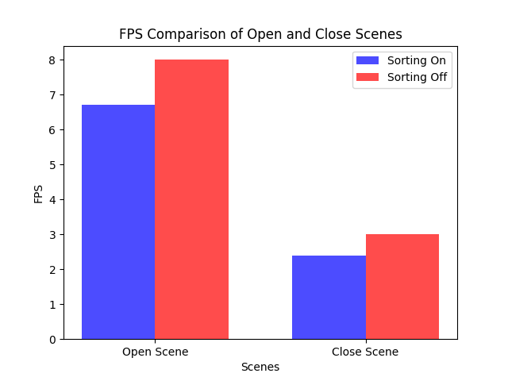
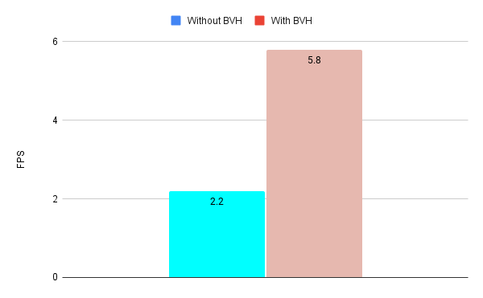
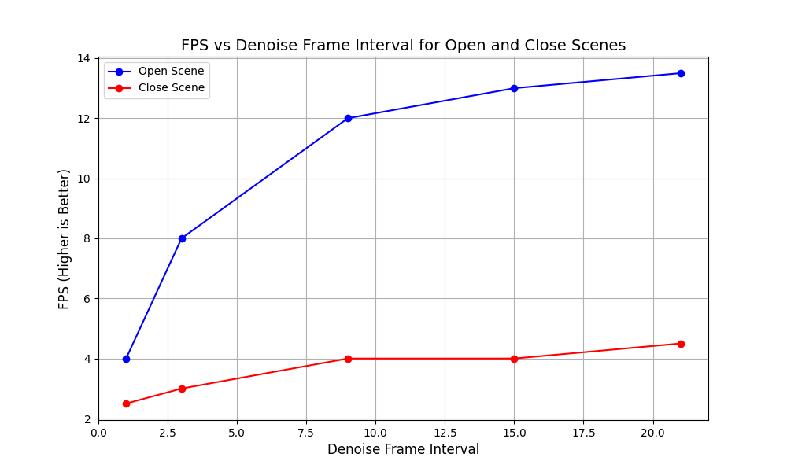
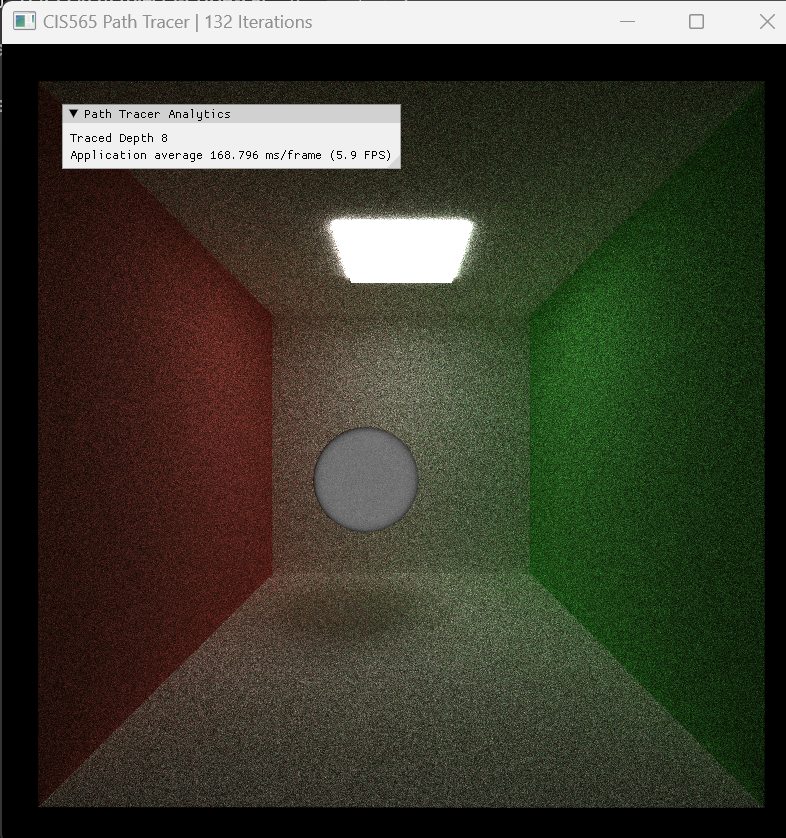
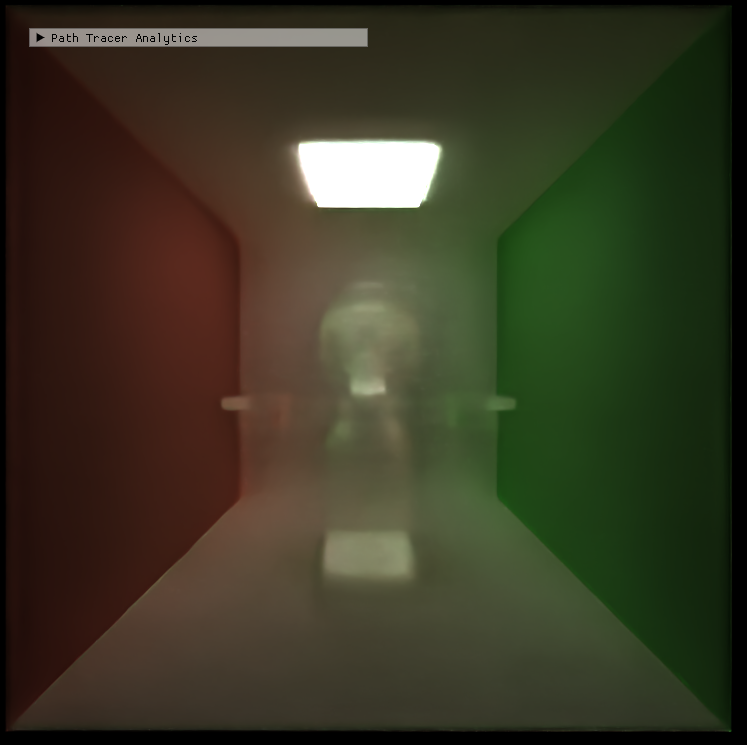

CUDA Path Tracer
================

**University of Pennsylvania, CIS 565: GPU Programming and Architecture, Project 3**

* Zixiao Wang
  * [LinkedIn](https://www.linkedin.com/in/zixiao-wang-826a5a255/)
* Tested and rendered on: Windows 11, i7-12800H @ 2.40 GHz 32GB, GTX 3070TI (Laptop)

## Showcase Image (1920 * 1080)


## Introduction

In this project, I implement a CUDA-based path tracer capable of rendering globally illuminated images quickly. The core renderer includes a shading kernel with BSDF evaluation for Ideal diffuse, perfectly specular-reflective, combination of refraction and reflection, and imperfect specular surface incorporated with roughness parameters. Further, it also explores the features of OBJ and Texture loading, Depth of Field, Environment Mapping/Lighting, BVH structure, and Denoising. The Sections below each specify the output and implementation of each feature, including performance analysis of optimization and further development direction. To import and use the project for your own models, please follow the [instructions section](https://github.com/Lanbiubiu1/Project3-CUDA-Path-Tracer?tab=readme-ov-file#instruction) below.


## BRDF Shading (Bidirectional Reflectance Distribution Function shading)

### Ideal diffuse shading: 
#### The image shows basic Lambertian shading in the Cornell box scene

 

### Ideal Specular Shading： 
#### The image shows perfect specular surface shading in the Cornell box scene


### Imperfect reflection: 
#### below are 4 images incorporated with different roughness. The edge of the reflection image becomes more and more blurred while roughness increases. Implementation reference [ PBRTv4 9.3 ](https://pbr-book.org/4ed/Reflection_Models/Specular_Reflection_and_Transmission)
* Top left is roughness 0.0 (the light is dim because the light parameter is about 0.3 less, but it does not affect the roughness effect)
* Top right is roughness 0.3
* Low left is roughness 0.6
* Low right is roughness 0.9

   

### Refraction and Reflection: 
#### Refraction with Fresnel effects using [Schlick's approximation](https://en.wikipedia.org/wiki/Schlick's_approximation). Implementation Reference [PBRTv4 9.3](https://pbr-book.org/4ed/Reflection_Models/Specular_Reflection_and_Transmission)

* In the real world, reflection and refraction might happen at the same time in one spot. But here, we sample one pixel with 600 samples. Then, for each sample, Monte Carlo was utilized to decide on either refraction or reflection. Once averaged out, it is real.


## Visual Features
### OBJ Mesh Loading and Texture Mapping ([TinyObj](https://github.com/tinyobjloader/tinyobjloader))
* left is final rendering
* middle is albedo (denoised)
* right is normal (denoised)
  
   

### Environment Map Lighting


### BVH accelerated spatial structure
* left is with BVH off, rendering at 4.6 FPS
* right is with BVH on, rendering at 15.5 FPS
* The mesh is about 3896 triangles
* A detailed performance analysis in [later section](https://github.com/Lanbiubiu1/Project3-CUDA-Path-Tracer#bvh-bounding-volume-hierarchy)

 

### DOP (Depth of Field), implementation reference [PBRT 5.2.3](https://pbr-book.org/4ed/Cameras_and_Film/Projective_Camera_Models#TheThinLensModelandDepthofField) and [PBRT A.5.2](https://pbr-book.org/4ed/Sampling_Algorithms/Sampling_Multidimensional_Functions#UniformlySamplingHemispheresandSpheres)


* the left image using a thin lens camera model, with "APERTURE": 0.25 and "FOCALDist": 10, so the object far from camera is blurred.

* the right image using "APERTURE": 0.25 and "FOCALDist": 40, so the object close to camera is blurred.
 

### Denoise with [intel Open Image Denoise](https://github.com/RenderKit/oidn)
* The left side is without the denoise filter, the right side is with the denoise filter, the image is about 350 samples per pixel
* Prefiltering both [normal buffer](https://github.com/Lanbiubiu1/Project3-CUDA-Path-Tracer/blob/main/img/cornell.2024-10-04_22-52-44z.350samp.png) and [albedo buffer](https://github.com/Lanbiubiu1/Project3-CUDA-Path-Tracer/blob/main/img/cornell.2024-10-04_22-51-16z.350samp.png)as auxiliary data, then [feed filtered albedo and normal](https://github.com/RenderKit/oidn?tab=readme-ov-file#denoising-with-prefiltering-c11-api) in with unfiltered image(beauty) buffer
* set hdr as true, so the image color buffer can be higher than 1.

 

## Performance Analysis
* 1D block with size 128, 2D blocks with size 8*8
* BVH On, Ray Partition On
* Sorting material Off
* Max Depth 8
* Denosing every 3 frames and prefiltering normal and albedo

### Material Sorting
The key idea behind sorting rays is to group path segments by material, coloring each path segment in a buffer and then performing BSDF evaluation using a unified shading kernel. Since different materials or BSDF evaluations require varying amounts of time to complete, sorting rays or path segments so that those interacting with the same material are contiguous in memory optimizes performance by minimizing divergent execution during shading. The overhead introduced by sorting may not be worth it in this case. 


#### The higher the better
#### The Open Scene has 4 materials using environment lighting, close scene uses 8 materials including lighting and walls
In the open scene, when sorting is enabled, the FPS is about 7, while disabling sorting gives a slightly better FPS of 8. This means there is a performance loss of approximately 12.5% when sorting is enabled. The open scene may not benefit much from sorting because the materials are few in number. In the close scene, enabling sorting reduces the FPS to 2.4, while disabling sorting results in a better FPS of 3 FPS. This is a 20% performance degradation when sorting is turned on. The close scene has more material interactions. Sorting might be adding additional computational overhead that outweighs its benefits. But, ideally, in larger scenes with more materials, sorting rays based on materials can have a significant impact on performance.

### BVH (Bounding Volume Hierarchy) 

Bounding Volume Hierarchy (BVH) is a spatial data structure commonly used in ray tracing, to accelerate the process of determining whether a ray intersects with objects in a scene. It organizes objects in a scene into a tree-like structure of bounding volumes, which are simple geometric shapes that enclose more complex objects. BVH helps improve performance by reducing the number of expensive ray-object intersection tests that need to be performed during rendering.


#### The higher the better

In open scenes, where there may be a large number of objects or wide spaces with fewer occlusions, BVH helps by efficiently culling large parts of the scene that don't need to be rendered or intersected with rays. Without BVH, the renderer has to check every object individually, leading to a massive performance penalty. Close scenes might involve more detailed geometry or smaller objects, but BVH still helps by allowing the renderer to avoid unnecessary ray-object intersection checks for objects. This shows that BVH is essential for efficient rendering, especially in larger or more complex scenes where the number of objects can overwhelm the renderer without efficient spatial partitioning.

### Denoise
Intel Open Image Denoise is an open-source, high-performance library developed by Intel that provides state-of-the-art, AI-powered denoising algorithms for ray-traced images. It is designed to remove noise from images generated by Monte Carlo ray tracing, offering near-photorealistic quality with fewer samples. It is obvious the denoise will be more costly since it requires more memory access steps and computational steps, so the test is done with Denoise on in open and closed scenes with different denoise intervals.



Reducing the denoising frequency greatly benefits performance, with the most significant jump occurring between denoising every frame and denoising every 3 frames. After a 9-frame interval, the performance benefits level off, suggesting that further increasing the interval provides only minor FPS gains. After a 9-frame interval, the performance benefits level off, suggesting that further increasing the interval provides only minor FPS gains. Open Scene performs significantly better overall, with FPS reaching over 13 FPS at higher denoise intervals. This indicates that open scenes are less computationally expensive to denoise, likely due to fewer objects or less detailed surfaces compared to closed scenes. Closed performs worse, with FPS maxing out at 4.5 FPS, even with infrequent denoising. This suggests that close scenes are more resource-intensive to denoise due to the proximity of objects, higher surface detail, and more complex lighting interactions. The best choice is obviously only to denoise the final image, as we can see the fps increases while the interval increases, so it reduces overhead on both memory and computation if the denoised filter is only used once. In this case, the denoise can help drastically reduce the sample number per pixel which means the necessary rendering time to get the nice picture is much less.

## Instruction
Download the necessary third-party library and Link the OIDN library in CMakeList in important parts
```# Define OIDN root directory
set(OIDN_ROOT "${CMAKE_SOURCE_DIR}/src/thirdparty/oidn-2.3.0.x64.windows")
set(OpenImageDenoise_DIR "${OIDN_ROOT}/lib/cmake/OpenImageDenoise-2.3.0")
find_package(OpenImageDenoise REQUIRED)
```
Watch out for the OIDN CUDA version library, it might not be compatible with your CUDA version. In this project, I did not use the library, so I commented it out. But if you are using it, please make sure you have the right version of CUDA installed.

```target_link_libraries(${CMAKE_PROJECT_NAME}
    ${LIBRARIES}
    cudadevrt
    ${OpenImageDenoise_LIBRARIES}
    "${OIDN_ROOT}/lib/OpenImageDenoise.lib"
    "${OIDN_ROOT}/lib/OpenImageDenoise_core.lib"
    #"${OIDN_ROOT}/lib/OpenImageDenoise_device_cuda.lib"
    #stream_compaction  # TODO: uncomment if using your stream compaction
    )

add_custom_command(TARGET ${CMAKE_PROJECT_NAME} POST_BUILD
    COMMAND ${CMAKE_COMMAND} -E copy_if_different
        "${OIDN_ROOT}/bin/OpenImageDenoise.dll"
        "${OIDN_ROOT}/bin/OpenImageDenoise_core.dll"
        "${OIDN_ROOT}/bin/OpenImageDenoise_device_cuda.dll"
        $<TARGET_FILE_DIR:${CMAKE_PROJECT_NAME}>
)
```
Download the model you like in OBJ file format. The model should be kept under ``./scene/ `` The Texture file should be kept under ``./scene/texture/the_folder_you_created/``.
```
  "Objects": [  {
    "TYPE": "mesh",
    "MATERIAL": "robot",
    "FILENAME": "../scenes/scifi_scout_girl.obj",
    "TRANS": [ 0.0, 0.5, 0.0 ],
    "ROTAT": [ 0.0, -20.0, 0.0 ],
    "SCALE": [ 0.5, 0.5, 0.5 ]
  }

]
```

Modify or Create the new Scene JSON file to include all of your OBJ model and Texture file locations. And all of the necessary coordination of your models in the scene. For example:
```"Materials": {
"robot": {
  "TYPE": "Specular",
  "RGB": [ 0.9, 0.9, 0.9 ],
  "ROUGHNESS": 0.5,
  "ALBEDO_MAP": "../scenes/texture/robot/mat_uv_set_01_BaseColor.png",
  "NORMAL_MAP": "../scenes/texture/robot/mat_uv_set_01_Normal.png"
}
```


Also to play with camera perimeter to adjust the DOF feature with "APERTURE" and "FOCAL":
```
"Camera": {
  "RES": [ 1920, 1080 ],
  "FOVY": 45.0,
  "ITERATIONS": 500,
  "DEPTH": 8,
  "FILE": "cornell",
  "EYE": [ 0.0, 5.0, 10.5 ],
  "LOOKAT": [ 0.0, 5.0, 0.0 ],
  "UP": [ 0.0, 1.0, 0.0 ],
  "APERTURE": 0.0,
  "FOCAL": 50


}
```
To toggle BVH and Sorting on and off, reset the valuable in ```./src/pathtrace.cu```

```
//switch between material
const bool SORT_BY_MATERIAL = false;
//toggleable BVH
const bool BVH = true;
```


## Buggy Image

### offset matters! in floating-point computation, the difference between 0.001 and 0.00001


### Do not feed denoised images back for path tracing, Denoiser hates nice pictures. Use separate the buffers to keep ray tracing data and denoised data


### kind of forget what bug is this, but I do know debugging is 80% of path tracing project


## Contribution
### Thrid Party Open Source Tools and Code
* TinyOBJ: https://github.com/tinyobjloader/tinyobjloader
* stb: https://github.com/nothings/stb?tab=readme-ov-file, stb_image: https://github.com/nothings/stb/blob/master/stb_image.h
* Intel Open Image Denoise (OIDN): https://github.com/RenderKit/oidn
* BVH tutorial: https://jacco.ompf2.com/2022/04/13/how-to-build-a-bvh-part-1-basics/
* CUDA Texture OBJ: https://developer.download.nvidia.com/cg/tex2D.html; https://docs.nvidia.com/cuda/cuda-runtime-api/group__CUDART__TEXTURE__OBJECT.html; https://forums.developer.nvidia.com/t/read-back-texture-to-host-memory-from-cudatextureobject/247689/2
* DOF and sampling disk: [PBRT 5.2.3](https://pbr-book.org/4ed/Cameras_and_Film/Projective_Camera_Models#TheThinLensModelandDepthofField) , [SampleUniformDiskConcentric()](https://pbr-book.org/4ed/Sampling_Algorithms/Sampling_Multidimensional_Functions.html#SampleUniformDiskConcentric)
* More code implementations can be referenced to [PBRT](https://pbr-book.org/)
### Models
most of the models I used are purchased under a standard license, so I cannot upload them here, if you are interested in them, please use the link below to purchase and support the creators.
* Sci-Fi Scout Girl (SketchFeb): https://sketchfab.com/3d-models/sci-fi-scout-girl-8b5a6902a7974eb1a1d2d3bef6200f06
* K-VRC Lowpoly | Love, Death & Robots (SketchFeb): https://sketchfab.com/3d-models/k-vrc-lowpoly-love-death-robots-457b298b21454df7837edf4073de3d07
* HDRi Studio Lighting 014 (Artstation): https://www.artstation.com/marketplace/p/2NmKb/hdri-studio-lighting-014-for-your-3d-rendering
* Sorayama Statue / The Weeknd / Silver Girl (Artstation) : https://www.artstation.com/marketplace/p/pBz9o/sorayama-statue-the-weeknd-silver-girl-3d-character-fbx-obj-blender-project-cinema-4d-octane-render-project

