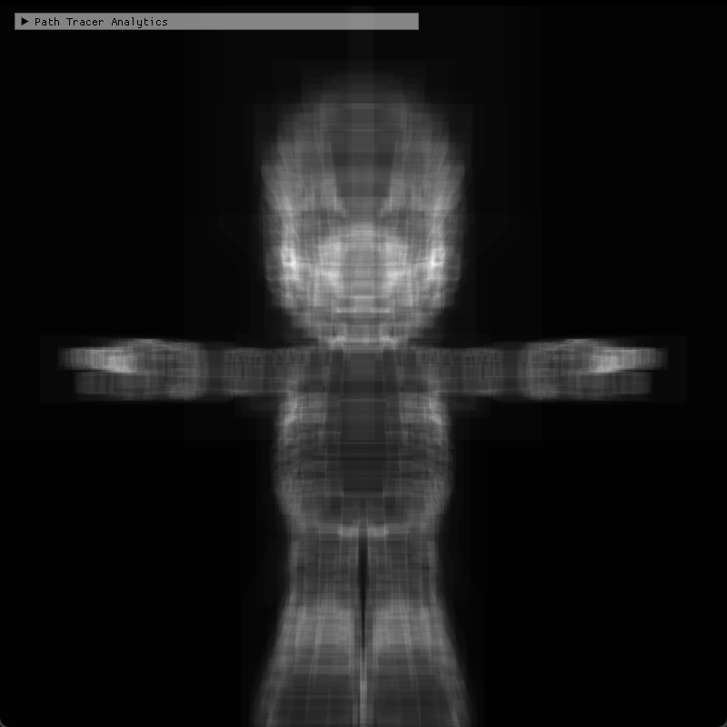

# CUDA Path Tracer

**University of Pennsylvania, CIS 565: GPU Programming and Architecture, Project 3**

- Jinxiang Wang
- Tested on: Windows 11, AMD Ryzen 9 8945HS w/ Radeon 780M Graphics 4.00 GHz 32GB, RTX 4070 Laptop 8 GB

## Results Preview:

A large mineway castle shaded with one Disney BRDF material (6,490,766 triangles, 300 spp, 6.1 fps)

A stanford dragon shaded with refract material

## Features Implemented:

1. Bounding Volume Hierarchy (HLBVH)
2. Disney DRDF model (not fully correct in some cases)
3. GUI for dynamic material modification
4. Muiti-Importance Sampling
5. ACES Tone Mapping
6. TinyObj mesh loading
7. Stocastic Sampled Anti-Aliasing

# Bounding Volume Hierarchy

The base code shoots rays out from the camera and compute intersections with all objects in the scene.

This works fine when we can implicitly define intersecting method for each geometry (just like SDF). But after mesh loading feature is implemented, the way of light-scene intersection is changed from calculating
intersection with implicit geometries to calculating it with all triangles!

This gives an extremely low performance when model with many faces is loaded:
| < 200 faces (~60 fps) | ~6000 faces (< 10 fps) |
| -------------------------------- | ------------------------------- |
|  |  |

To effectively reduce the amout of intersection computation, we could use BVH, Bounding Volume Hierarchy, which construct
a tree-like structure to store scene primitives.

The efficiency of BVH depends on how we build the tree. There are many ways to segment triangls, for this project, I used HLBVH, which is a combination of Surface Area Heuristic (SAH) and morton code based Linear BVH. For more reference, check [PBRT 4.3 Bounding Volume Hierarchy](https://pbr-book.org/3ed-2018/Primitives_and_Intersection_Acceleration/Bounding_Volume_Hierarchies).

And this gives a very good speed up

| Before BVH (< 10 fps)           | After BVH (~30 fps)           |
| ------------------------------- | ----------------------------- |
|  |  |

We can go even further with a stanford dragon (2,349,078 triangles)

| Dragon ( 15 fps)            |
| --------------------------- |
|  |

Visualizer:
| Wahoo | Dragon | Mineway Castle |
| ------------------------------- | ----------------------------- | --------------------------- |
| 5117 triangles | 2,349,078 triangles | 6,490,766 triangles |
|  |  |  |
