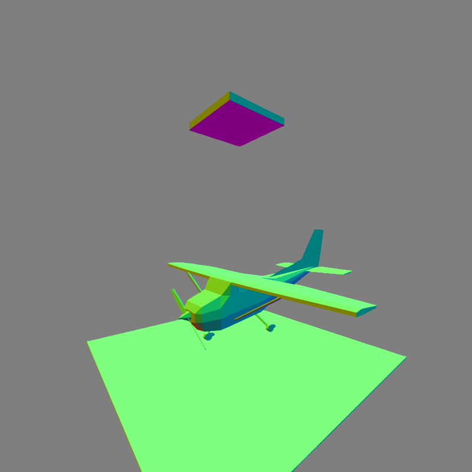
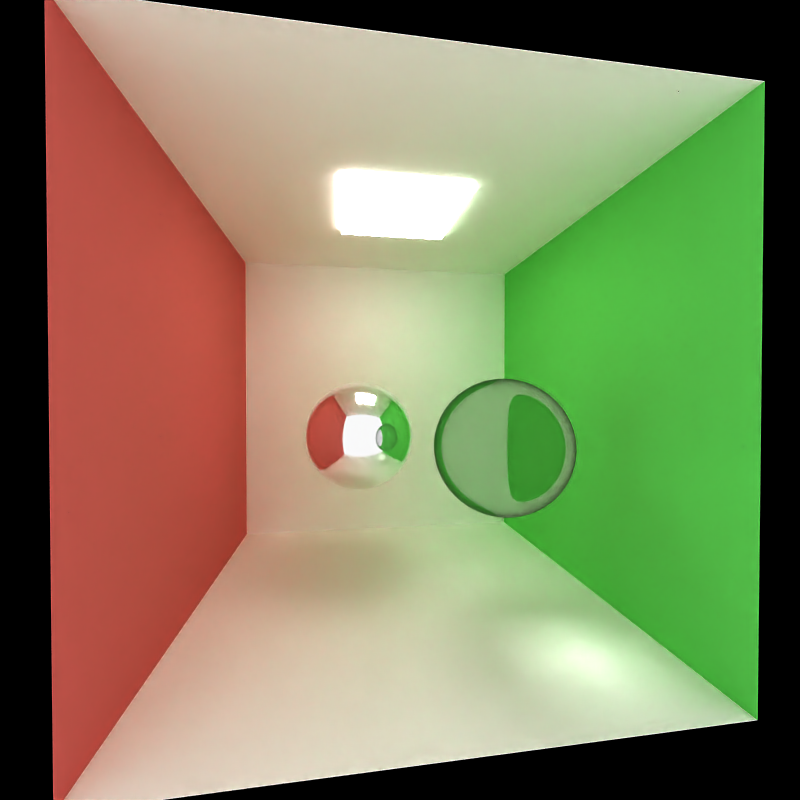
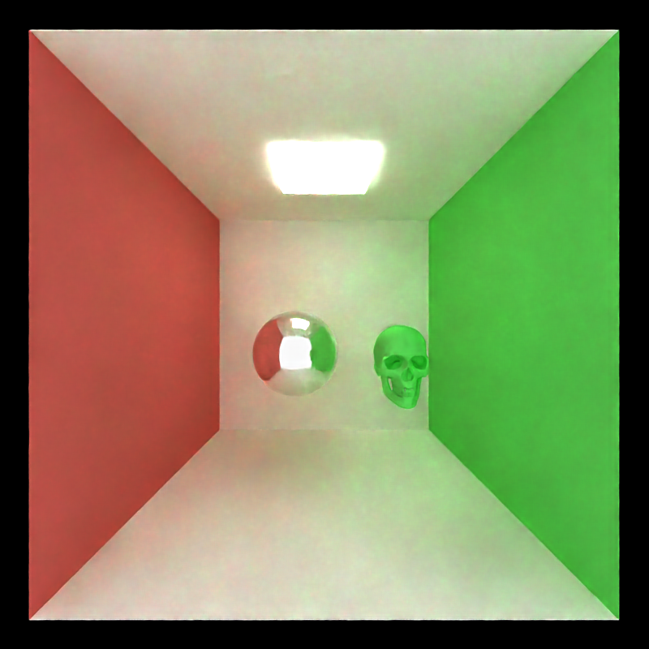
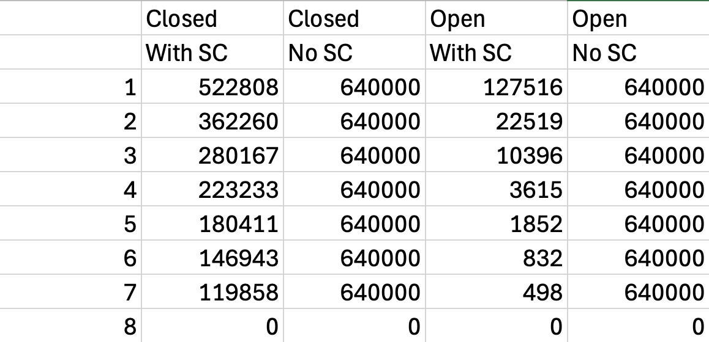

# CUDA Path Tracer

==================

**University of Pennsylvania, CIS 5650: GPU Programming and Architecture, Project 3 - Path Tracer**

- Jordan Hochman
  - [LinkedIn](https://www.linkedin.com/in/jhochman24), [Personal Website](https://jordanh.xyz), [GitHub](https://github.com/JHawk0224)

* Tested on: Windows 11, Ryzen 7 5800 @ 3.4GHz 32GB, GeForce RTX 3060 Ti 8GB (Compute Capability: 8.6)

## Welcome to my Path Tracer Project!

In this project, I implemented a path tracer that includes the following features:

- Support for different surfaces
  - Ideal diffuse surfaces
  - Perfectly specular-reflective
- Path continuation and termination using Stream Compaction
- Contiguous memory path sorting
- Antialiasing with stochastic sampling
- Refraction (e.g. glass/water) with Frensel effects
  - Imperfect specular surfaces
- Physically-based depth-of-field
- Arbitrary mesh loading and rendering for `glTF` files
  - Includes toggleable bounding volume intersection culling
- Denoising with [OIDN](https://github.com/OpenImageDenoise/oidn)

I will now go through each feature with images depicting them, as well as analysis for the ones that affect performance.

### Diffuse Surface

### Specular Surface

### Refraction

Here you can see that refraction was implemented. Interestingly, this does not actually have much of a performance impact since all it does is use a different method of shading each path. Other than the different method of shading, everything else is the same, so the performance is about the same.

The hypothetical CPU version of this would be the same as the hypothetical CPU version of the normal path tracer, where each path is computed sequentially. This feature was pretty easy to implement on top of the current path tracer since it only modified one step. This feature specifically doesn't benefit any more from being on the GPU compared to a normal path tracer. (They both run at about 8 fps for `cornell.json`.)

### Antialiasing

### Physically Based Depth of Field

Here you can see the depth of field and the changing focal distance. The effect is controlled by 2 parameters, one is the lens radius and the other is the focal distance. Interestingly, this does not actually have much of a performance impact. It is really easy to implement, and just involves moving the camera slightly for each pixel calculated. The only difference is in the origin of the ray from the camera. Since all it does is use this slightly different ray and everything else is the same, the performance is about the same.

The hypothetical CPU version of this would be the same as the hypothetical CPU version of the normal path tracer, where each path is computed sequentially. This feature was pretty easy to implement on top of the current path tracer since it only modified one step. This feature specifically doesn't benefit any more from being on the GPU compared to a normal path tracer. (They both run at about 8 fps for `cornell.json`.)

### Arbitrary Mesh Loading

Here you can see that any arbitrary mesh in the form of `.glb` and `.gltf` can be loaded. Of course, since you can now load much more complex objects with many more triangles (than the basic cube/sphere), this can have some performance impacts for complicated meshes. For example, a simple mesh like just a cube on `cornell.json` runs at about 8 fps, while about 1 fps with the `porsche.glb` model. Because of this, it's important to also implement speed ups for collision testing.

To do this, I also implemented a toggleable option that controls the bounded volume culling. When this is enabled, there is a box around the entire object, and this is first checked for collision before every triangle of the mesh. If there is no collision, then we can skip on checking each triangle, saving computation. When running this on the `porsche.glb` model, it bumps the performance from about 1 fps to about 3 fps. For even more complicated scenes and models, this difference would be noticeable.

The hypothetical CPU version of this would be the same as the hypothetical CPU version of the normal path tracer, where each path is computed sequentially. This feature does benefit from being on the GPU because much more complicated objects can be loaded.

In the future, I would like to implement a BVH which is another method to partition up meshes. This would massively improve the performance when rendering complicated meshes, and is an obvious next step.

### Denoising

The denoiser doesn't actually affect the path tracing at all. All it does is apply a (pre-trained) machine learning model on the output image to remove the noise (the random dots spread across the image). The performance impact is pretty small in comparison to the path tracer itself, since it only needs to perform one pass on the output image (and it could also technically be done in parallel to the path tracer running on the next frame). Also, it doesn't need to be computed every frame, only occasionally,

However, as you can see it does have a massive different in the output and makes it look much better, so it's basically a must have. It doesn't affect performance too much. It can be toggled on and off though. The performance has no noticeable difference with this on and off (about 8 fps for `cornell.json` either way).

#### Frame 1 of Denoiser

### Debug Images

#### Albedo and Normal Maps for Denoising

## Analysis

When running stream compaction, there was a noticeable speedup for scenes that were open. However, for closed scenes, this was not as apparent. Looking at the performance, we got about 1 more frame per second for closed scenes (on `cornell.json`) (from about 7.6 fps to about 6.7 fps without stream compaction). However, with an open scene (`airplane.json`), there is a difference of about 3.5 fps (from 10.2 fps with stream compaction to 6.8 fps without it). The reason that open scenes were sped up more is that the stream compaction affects when paths terminate early. Thus for open scenes, when a path ends and is moved by the compaction, there is less warp divergence. Thus the speedup is more noticeable when there are more paths that end early, which is what happens in open scenes.

To demonstrate this further, I also measured the number of active paths after each depth of the first iteration (the first frame) of each render (with and without stream compaction). Below is a summary of the data, although you can find the rest in [here](stream-compaction-data.xlsx) in `stream-compaction-data.xlsx`.

First of all, for the versions without stream compaction, there were 640000 paths for each iteration. This was a constant value because all of them stayed active, and they stayed active because the warps containing them stayed active (there was at least one path in the warp that hadn't ended yet). However, you can see that the versions with stream compaction had dramatically less active paths, and these were only reduced each iteration. While the stream compacted version in a closed scene had somewhat of a reduction (by up to 6 times), the version in an open scene had a much more massive decrease from 6 times to 1000 times! Clearly, stream compaction has a massive effect, and especially in an open environment (because it reduces warp divergence and lets warps terminate early).

Additionally, when we have different materials for each path segment, there will be large divergence in the warps since each material needs to be handled differently. Therefore, by sorting the paths in advance by the material, we can minimize the warp divergence and hence speed up the iterations.

## Scene File Description

If you are interested in running this project yourself and making your own scenes, you will need to understand how the scene files are constructed (in `/scenes`). This project uses a JSON-based scene description format to define all components of a scene, such as materials, objects, lights, and camera settings. The scene file is structured as a JSON object with clearly organized sections for different elements, providing a clean and extendable format. Most of the basics can be found [here](INSTRUCTION.md) in `INSTRUCTION.md`, but there are a few significant deviations. The main one is that for the objects, there is a new type called `mesh`. This represents an arbitrary mesh that can be loaded in. To do this, just put the `.glb` or `.gltf` file under the `FILE` field. Finally, there are 3 optional translation, rotation, and scale vectors. These perform the operation on the entire imported object mesh respectively.

The details of the other fields can be found in `INSTRUCTION.md`.

### Other Project Modifications

In addition to run this project, it's important to note these changes to `CMakeLists.txt`. In order to link OIDN, I included and linked the `lib`s and `dll`s from the [precompiled Windows version](https://www.openimagedenoise.org/downloads.html) of OIDN in `external/oidn-2.3.0.x64.windows`.

## Credits

### Code

In this project, I used the following external sources and give credit to:

- [OIDN](https://github.com/OpenImageDenoise/oidn) for denoising
- [tinygltf](https://github.com/syoyo/tinygltf/) for parsing glTF files

### Scenes and Object Files

- `avocado.glb`: [Link](https://github.com/KhronosGroup/glTF-Sample-Models/tree/main/2.0/Avocado) - [Khronos Group sample models for glTF](https://github.com/KhronosGroup/glTF-Sample-Models) (for [Khronos glTF Blender I/O](https://github.com/KhronosGroup/glTF-Blender-IO))
- `lattice_man.glb`: [Link](https://www.turbosquid.com/3d-models/3d-model-lattice-structured-man-figure-2132586) - Model by [SuicideSquid](https://www.turbosquid.com/Search/Artists/SuicideSquid) [CC-BY](https://blog.turbosquid.com/turbosquid-3d-model-license/) via Turbosquid
- `monkey.gltf`: [Link](https://github.com/KhronosGroup/glTF-Sample-Models/tree/main/2.0/Suzanne) - [Khronos Group sample models for glTF](https://github.com/KhronosGroup/glTF-Sample-Models) (for [Khronos glTF Blender I/O](https://github.com/KhronosGroup/glTF-Blender-IO))
- `person.glb`: [Link](https://poly.pizza/m/qbDLeTtb8K) - Character Base by [madtrollstudio](https://poly.pizza/u/madtrollstudio) [CC-BY](https://creativecommons.org/licenses/by/3.0/) via Poly Pizza
- `porsche_textures.glb` and `porsche.glb`: [Link](https://sketchfab.com/3d-models/free-1975-porsche-911-930-turbo-8568d9d14a994b9cae59499f0dbed21e) - Model by [Lionsharp Studios](https://sketchfab.com/lionsharp) [CC-BY](https://creativecommons.org/licenses/by/4.0/) via Sketchfab
- `skull_textures.glb` and `skull.glb`: [Link](https://sketchfab.com/3d-models/skull-downloadable-1a9db900738d44298b0bc59f68123393) - Model by [martinjario](https://sketchfab.com/martinjario) [CC-BY](https://creativecommons.org/licenses/by/4.0/) via Sketchfab
- `small_airplane.glb`: [Link](https://poly.pizza/m/7cvx6ex-xfL) - Small Airplane by [Vojtěch Balák](https://poly.pizza/u/Vojt%C4%9Bch%20Bal%C3%A1k) [CC-BY](https://creativecommons.org/licenses/by/3.0/) via Poly Pizza
- `toy_car.glb`: [Link](https://github.com/KhronosGroup/glTF-Sample-Models/tree/main/2.0/ToyCar) - [Khronos Group sample models for glTF](https://github.com/KhronosGroup/glTF-Sample-Models) (for [Khronos glTF Blender I/O](https://github.com/KhronosGroup/glTF-Blender-IO))

## Bloopers

### Initial Attempts at Diffuse Surfaces

### Failed Albedo Maps

### Failed Normal Maps

