CUDA Path Tracer
================

**University of Pennsylvania, CIS 565: GPU Programming and Architecture, Project 3**

* Zhen Ren
  * https://www.linkedin.com/in/zhen-ren-837089208/
* Tested on: Windows 11, i9-13900H @ 2.60 GHz 16GB, RTX 4070 Laptop 8GB (Self laptop)

## User Instructions
### Hot Keys
| Keys| Usage               |
|-----|---------------------|
| ESC | Quit and save image |
| P   | Save image          |
| Z   | Zoom in             |
| X   | Zoom out            |
| W   | Moving up           |
| S   | Moving down         |
| F   | Auto focus          |

### Auto Focus
Auto focus is a very convenient helper to let you focus on any object you want. Hovering your mouse over the object you want to focus and then press **F**. This object will then be focused, i.e. the focal point is set to the object's surface. Also works for the tilt shift camera.

### Mouse control
The same as default setting. Left to rotate the camera, right to zoom the camera. Hold middle button to snap around the camera.

### ImGui Settings
ImGui is mainly used to control tilt shift camera. You can control the aperture size, lens shift and also the direction of focal plane.
You can also toggle ray compaction and material sort here.

## Gallery

| Mesa - shot using tilt shift camera (1920*1080 100spp aperture0.5)|
| :------------------------------------: |
||

| Vokselia Spawn (1920*1080 100spp 0.5aperture size)|
| :------------------------------------: |
|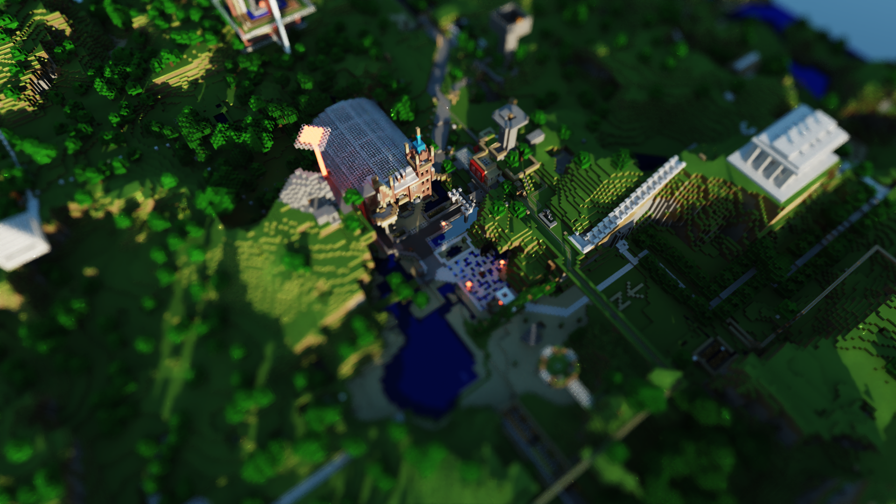|

| SpongeBob - shot using tilt shift camera (1920*1080 100spp)|
| :------------------------------------: |
||

| Dewmire Castle (1080*1080 100spp)|
| :------------------------------------: |
||

| Mando Helmet (1000*1000 76spp)|
| :------------------------------------: |
||

| White Girl Robot (1080*1080 500spp)|
| :------------------------------------: |
||

| Glass Dragon (1080*1080 1000spp)|
| :------------------------------------: |
||

| Glass Bunny (1080*1080 1000spp)|
| :------------------------------------: |
|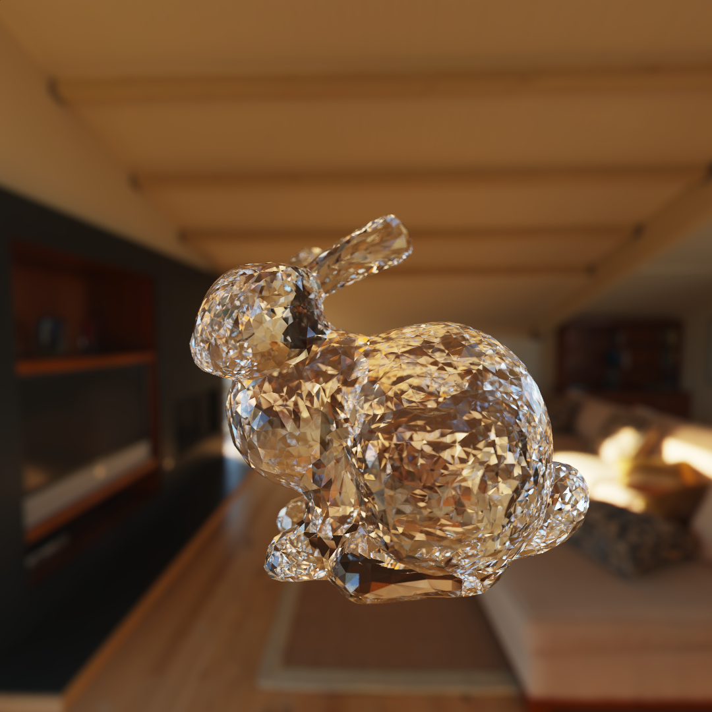|

# Core Features

## Tilt Shift Camera
### Introduction
>Tilt–shift photography, is the use of camera movements that change the orientation or position of the lens with respect to the film or image sensor on cameras.

>Tilt is used to control the orientation of the plane of focus (PoF), and hence the part of an image that appears sharp; it makes use of the Scheimpflug principle. Shift is used to adjust the position of the subject in the image area without moving the camera back; this is often helpful in avoiding the convergence of parallel lines, as when photographing tall buildings. --Wikipedia

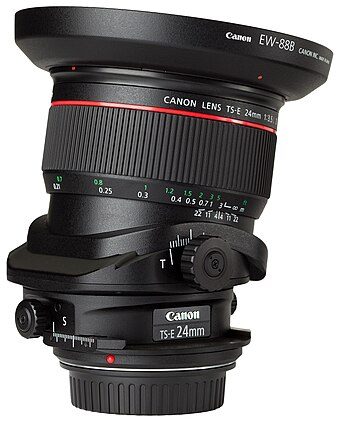

Tilt shift camera is an extension of normal thin lens camera. It is often used to do selective focus. Using the same aperture size, tilt shift camera can generate more focused images. So, tilt shift camera can achieve a miniature faking effect.

Sometimes, photographers may want to focus on arbitary places, like a set of buildings on one side of the street or the books on a certain layer of a shelf. However, when all objects lies on the same plane that is aligned with our camera, since we cannot find a depth relation between front and back objects, normal DoF cannot work. Tilt shift camera can break this rule.

### Implementation

Tilt shift camera works by tilting and moving around lens so that our focal plane is no more perpendicular to the caemra's forward direction.
|Tilt shift lens|Normal thin lens |
| :-: | :-: |
| 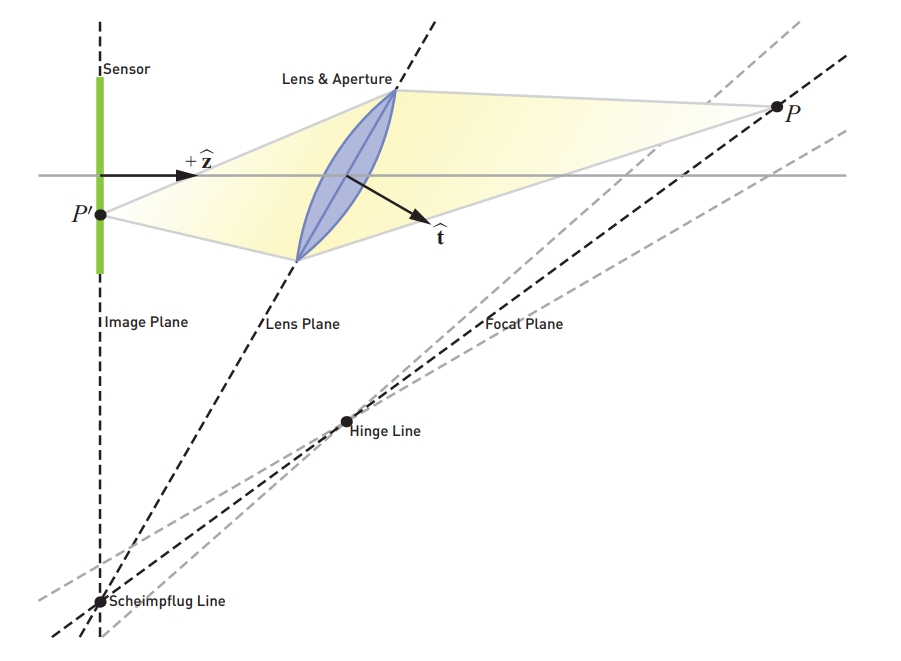|  |

When implementing this feature, we can do some simplification, or even make it more usable! When implementing normal thin lens camera, we actually ignore the distance between lens and sensor. The main idea is to find the focal plane and the focal point. Then, we can generate random samples on the lens and shoot rays towards focal point.

This idea can also be adapted by the tilt-shift lens model. We need to first find a focal point and a focal plane. Then, we generate samples from the lens and shoot rays towards the focal point. Also, for users, manipulating the focal point and focal plane is much easier than adjusting the angle of the lens. A physically correct input may not be a convenient one.

As I mentioned above, I have implemented an auto focus feature, which makes it possible to find a focal point. Then, combined with the normal of the focal plane, we can define the focal plane in 3D space. This can be done in ImGui. The following steps would then be similiar to normal DoF.

### Results

**All images below are using the same aperture size**

| Mesa - shot using thin lens camera (1920*1080 100spp aperture0.5)|
| :------------------------------------: |
||

| Mesa - shot using tilt shift camera (1920*1080 100spp aperture0.5)|
| :------------------------------------: |
||

**Vokselia Spawn (1920*1080 100spp 0.5aperture size) Focusing on the tower**

|With tilt shift camera|Normal thin lens camera|
| :-: | :-: |
| 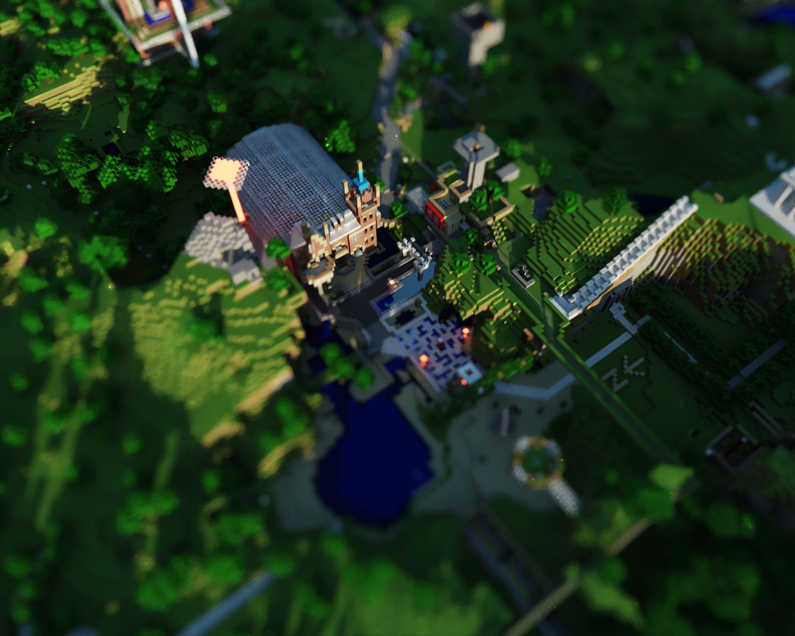| 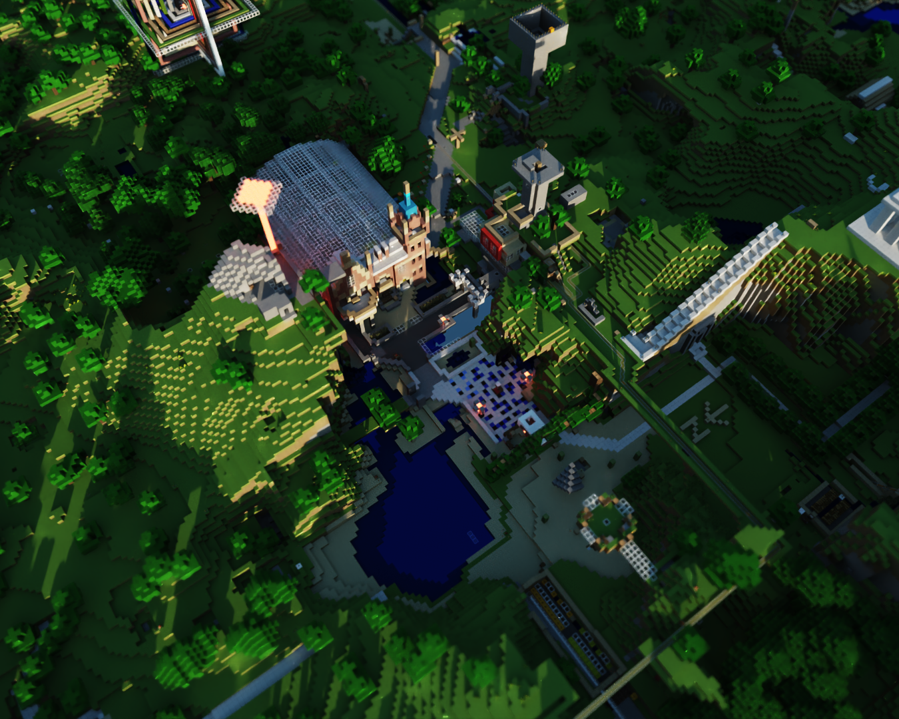 |

| SpongeBob - shot using tilt shift camera (1920*1080 100spp) Focusing on one side of the street|
| :------------------------------------: |
||

### Ray Compaction
When doing path tracing, some samples may hit nothing or be invalid. In this case, we can remove these samples from the array to reduce the following computation pressure.

#### Implementation
I used thrust library to help me do this task. Specifically, I used `thrust::remove_copy_if` and `thrust::remove_if` to do array compaction. The first step is to find out all finished rays, which have a 0 `remainingBounces`. Then, I copy these rays to a finished ray container while removing these rays from the active ray container. This is done to both intersection buffer and ray segment buffer.\
Also, I do ray compaction two times in a iteration. The first time is after intersection test and the compaction here is intended to remove miss hit rays. The second time is after shading, which is intended to remove invalid samples as well as terminated samples.

#### Performance
I used 3 test scenes to test the performance, which are: Mesa, cornell box and glass bunny.
| Scenes      | # of Primitives |
|-------------|-----------------|
| Mesa        | ~1.35M          |
| Cornell     | ~870k           |
| Glass Bunny | ~50k            |

| Cornell|
| :------------------: |
||

Mesa is a heavy outdoor scene. Cornell is a heavy indoor scene. Glass bunny is a light outdoor scene. Mesa and glass bunny are shown above. Cornell is a scene with all types of primitives (triangle, sphere, cube), and all types of materials (PBR gold, Metallic cu, Specular, Dielectric, Lambersian).

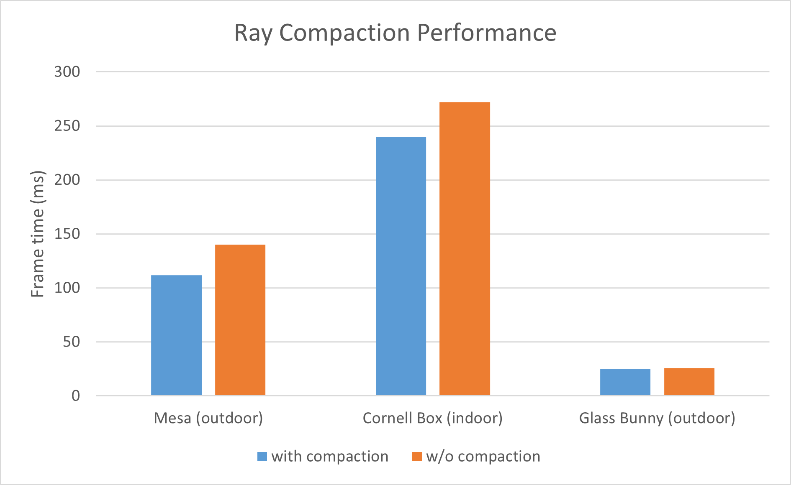

Frome the chat, we can see that ray compaction brings considerable performance improvement, especially on heavy outdoor scenes. This is because many rays would hit nothing and terminate early. Also, heavy jobs can cover the overhead of compaction job.

### Material Sort
The idea of material sort is to sort materials by their shading models in order to reduce warp divergence.

Sadly, material sort cannot bring performance improvement on all test scenes. The overhead of sorting is so large that speed up in shading cannot cover the cost of sorting.

| Nsight Compute Profileing (disabled light importance sample, so no visibility test in shading)|
| :------------------: |
||

By profiling the project using Nsight Compute, I find that `scene intersection` take up over 90% of the frame time. Shading task is fast compared to intersection. Therefore, the imporvement over shading part can be trivial or even negative.

### MTBVH
Bounding Volume Hierarchy (BVH) is a powerful data structure to do spatial splits. It significantly reduce the ray-scene intersection. I first use SAH to build a BVH on CPU side. The main challenge is to do tree traversal on GPU without a stack. To achieve this, I place the nodes of the BVH in a array follow the hit link order. Each BVH GPU node would also store a miss link to skip all children of current node and jump to the new node.

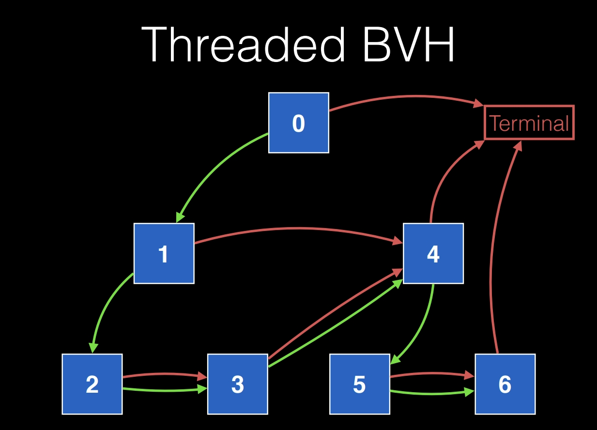

Another technique I used is called **Multiple-Threaded BVH**. The idea is to make 6 copies of the flattern tree and determine the traverse order by the main axis of the ray direction. The memory storage overhead is aceeptable since I compressed the MTBVH node to 16 byte, which is well aligned and also small. More implementation details [here](https://cs.uwaterloo.ca/%7Ethachisu/tdf2015.pdf)

A final optimization is to sort the primitives before flattenning the tree. Since each leaf node would contain at most 8 primitives, I want these primitives to be continuous in the memory, so I scatter the primitives to improve the locality.

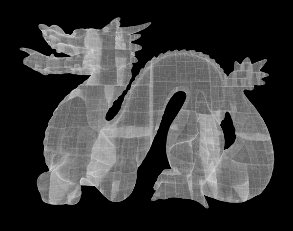

After visualization, we can see that BVH nodes are well distributed, all thanks to SAH.

I will only do performance comparison on glass bunny scene since naive scene intersection test is sooooo slow when we have over 100k primitives!

| Scenes      | with BVH | w/o BVH  |
|-------------|----------|--------- |
| Glass Bunny | ~40 FPS  | ~2.6 FPS |

We can see that in this simple scene (5k triangles), BVH brings an over 15 times performance boost.

## BSDFs

Five different shading model are supported:
- Lambertian
- Specular
- Microfacet
- MetallicWorkflow
- Dielectric

The implementation of Microfacet material is mainly from [PBRT v4](https://www.pbr-book.org/4ed/Reflection_Models/Roughness_Using_Microfacet_Theory), which samples distribution of visible normals.\
Later, you will see more PBR material models from glTF scenes.

## OBJ & glTF loading
All files are parsed and stored using my scene and object data structure so that they can work together in one scene. The cornell scene just include a dragon imported from an obj file.

## Texture Mapping
Currently support:
- Albedo map
- Normal map
- Metallic Roughness Map

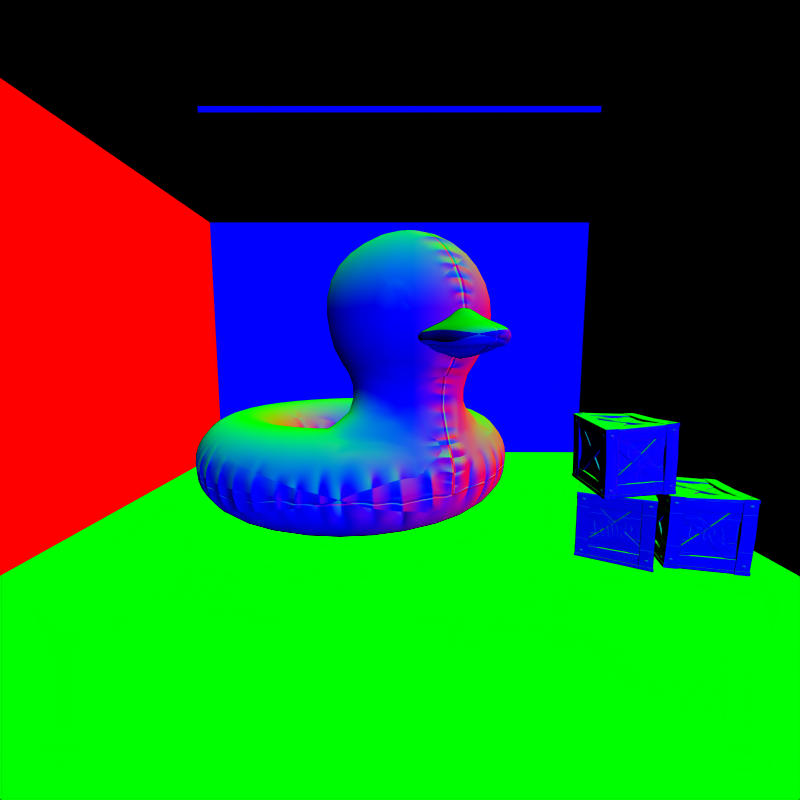

Maybe emissive map in the future?

## Environment mapping & MIS
Many environment maps are shown above. Here, I'd like to show how MIS works:
|With MIS|Naive sampling|
| :-: | :-: |
| |  |

For scenes or environments with only a small light source, it's difficult for random samples to hit these likes. Therefore, in the shading part, I generate a light importance sample using MIS weight.

As for how to generate importance samples on an env map, I precomputed the pdf distribution of each pixel and calculated its inverse CDF to find importance sample in O(1) time.

## Open Image Denoiser

|With Denoiser 50spp|No Denoiser 50spp|
| :-: | :-: |
| 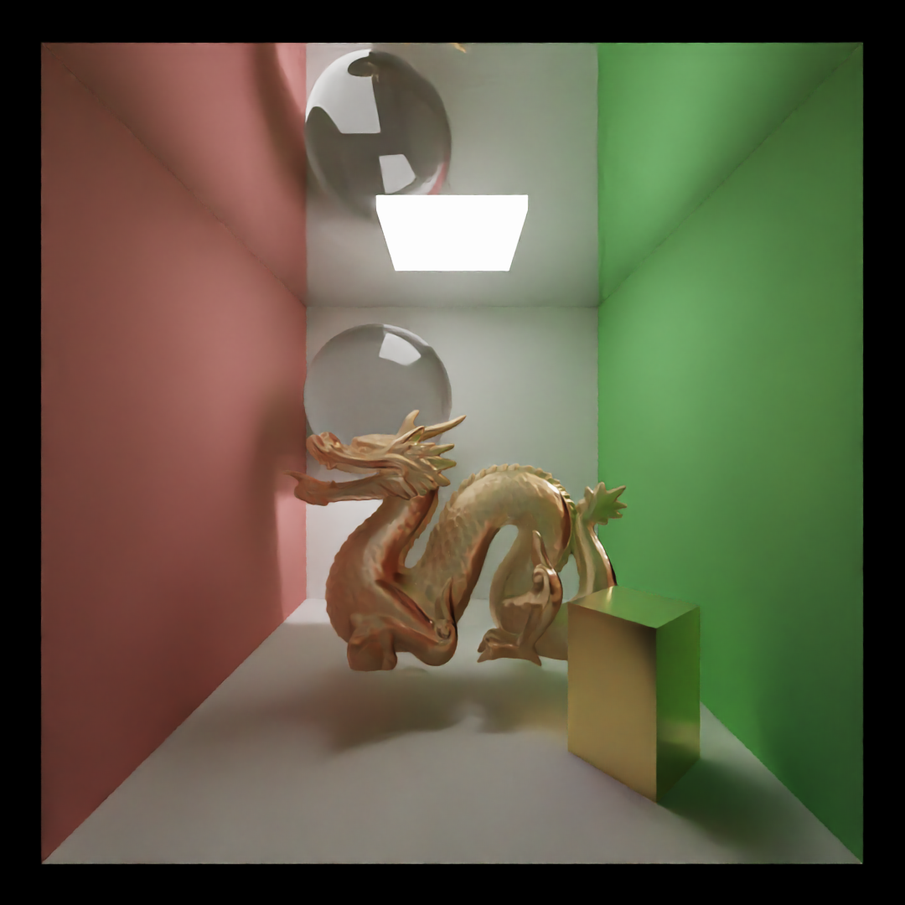| 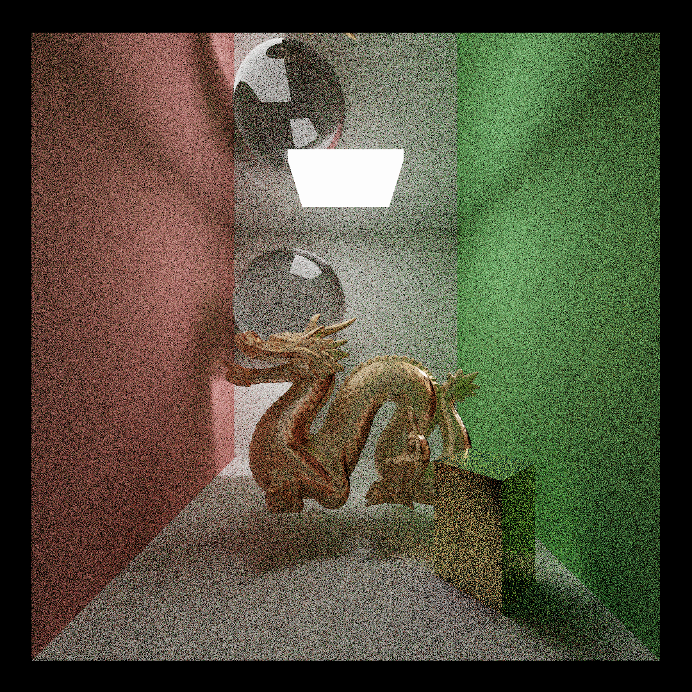 |

## Owen Scrambling Sobel Sequence
Based on the paper [Practical Hash-based Owen Scrambling](https://www.jcgt.org/published/0009/04/01/)
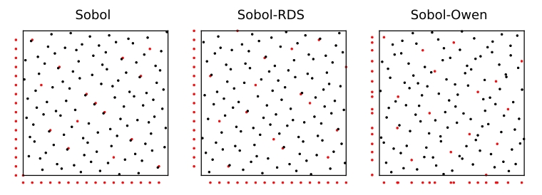

## ACES Mapping
More vivid images!
[Reference](https://knarkowicz.wordpress.com/2016/01/06/aces-filmic-tone-mapping-curve/)
|With mapping|Without mapping|
| :-: | :-: |
| | 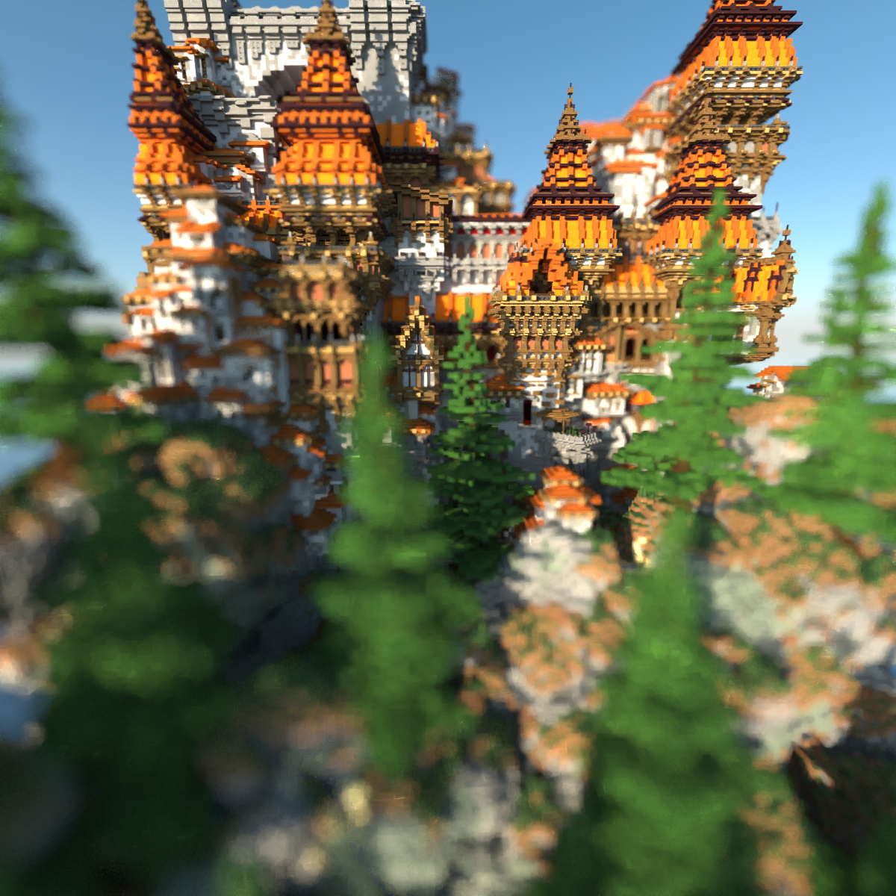 |

## References
#### BVH
- https://cs.uwaterloo.ca/%7Ethachisu/tdf2015.pdf
- https://arxiv.org/pdf/1505.06022
#### BSDF
- https://www.pbr-book.org/4ed/Reflection_Models/Roughness_Using_Microfacet_Theory
#### Owen Scrambling Sampling
- https://www.jcgt.org/published/0009/04/01/
- https://www.shadertoy.com/view/sd2Xzm
#### Environment mapping
- https://cs184.eecs.berkeley.edu/su20/docs/proj3-2-part-3
#### ACES Mapping
- https://knarkowicz.wordpress.com/2016/01/06/aces-filmic-tone-mapping-curve/
#### Tilt Shift Camera
- https://link.springer.com/chapter/10.1007/978-1-4842-7185-8_31