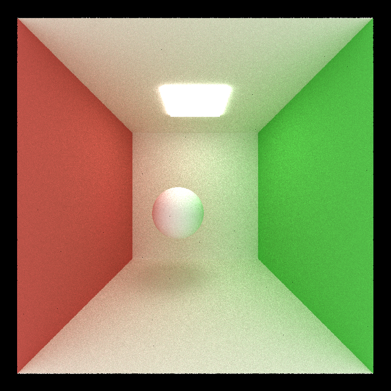
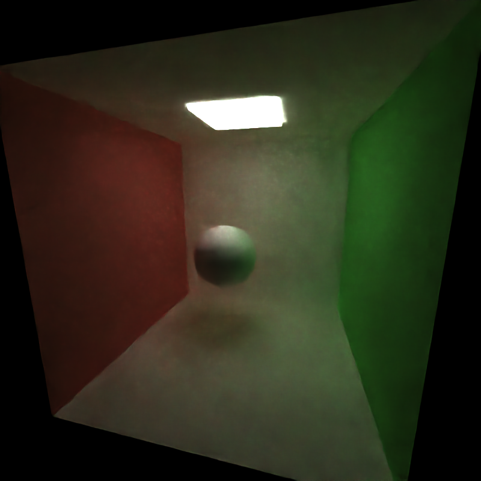

CUDA Path Tracer
================

**University of Pennsylvania, CIS 5650: GPU Programming and Architecture, Project 3 - Path Tracer**

- Jordan Hochman
  - [LinkedIn](https://www.linkedin.com/in/jhochman24), [Personal Website](https://jordanh.xyz), [GitHub](https://github.com/JHawk0224)
* Tested on: Windows 11, Ryzen 7 5800 @ 3.4GHz 32GB, GeForce RTX 3060 Ti 8GB (Compute Capability: 8.6)

## Welcome to my Path Tracer Project!

In this project, I implemented a path tracer that includes the following features:

- Support for different surfaces
    + Ideal diffuse surfaces
    + Perfectly specular-reflective
    + Diffuse surfaces
    + Specular surfaces
- Path continuation and termination using Stream Compaction
- Contiguous memory path sorting
- Antialiasing with stochastic sampling
- Refraction (e.g. glass/water) with Frensel effects
    + Imperfect specular surfaces
- Physically-based depth-of-field
- Arbitrary mesh loading and rendering for `glTF` files
    + Includes toggleable bounding volume intersection culling
- Denoising with [OIDN](https://github.com/OpenImageDenoise/oidn)

I will now go through each feature with images depicting them, as well as analysis for the ones that affect performance.

### Diffuse Surface

### Specular Surface

### Refraction

### Antialiasing

### Physically Based Depth of Field

### Arbitrary Mesh Loading

For this mesh loading, I also implemented a toggleable option that controls the bounded volume culling. When this is enabled, there is a box around the entire object, and this is first checked for collision before every triangle of the mesh. If there is no collision, then we can skip on checking each triangle, saving computation. We can see that it sped up the frames per second by about 10.

### Denoising

#### Frame 1 of Denoiser

### Debug Images

#### Albedo and Normal Maps for Denoising

## Analysis

When running stream compaction, there was a noticeable speedup for scenes that were enclosed. However, for open scenes, this was not as apparent. Looking at the performance, we got about 50 more frames per second for enclosed scenes.

Additionally, when we have different materials for each path segment, there will be large divergence in the warps since each material needs to be handled differently. Therefore, by sorting the paths in advance by the material, we can minimize the warp divergence and hence speed up the iterations.

## Scene File Description

If you are interested in running this project yourself and making your own scenes, you will need to understand how the scene files are constructed (in `/scenes`). This project uses a JSON-based scene description format to define all components of a scene, such as materials, objects, lights, and camera settings. The scene file is structured as a JSON object with clearly organized sections for different elements, providing a clean and extendable format. Most of the basics can be found [here](INSTRUCTION.md) in `INSTRUCTION.md`, but there are a few significant deviations. The main one is that for the objects, there is a new type called `mesh`. This represents an arbitrary mesh that can be loaded in. To do this, just put the `.glb` or `.gltf` file under the `FILE` field. Finally, there are 3 optional translation, rotation, and scale vectors. These perform the operation on the entire imported object mesh respectively.

The details of the other fields can be found in `INSTRUCTION.md`.

### Other Project Modifications

In addition to run this project, it's important to note these changes to `CMakeLists.txt`. In order to link OIDN, I included and linked the `lib`s and `dll`s from the [precompiled Windows version](https://www.openimagedenoise.org/downloads.html) of OIDN in `external/oidn-2.3.0.x64.windows`.

## Credits

### Code

In this project, I used the following external sources and give credit to:

- [OIDN](https://github.com/OpenImageDenoise/oidn) for denoising
- [tinygltf](https://github.com/syoyo/tinygltf/) for parsing glTF files

### Scenes and Object Files
- `avocado.glb`: [Link](https://github.com/KhronosGroup/glTF-Sample-Models/tree/main/2.0/Avocado
) - [Khronos Group sample models for glTF](https://github.com/KhronosGroup/glTF-Sample-Models) (for [Khronos glTF Blender I/O](https://github.com/KhronosGroup/glTF-Blender-IO))
- `monkey.gltf`: [Link](https://github.com/KhronosGroup/glTF-Sample-Models/tree/main/2.0/Suzanne) - [Khronos Group sample models for glTF](https://github.com/KhronosGroup/glTF-Sample-Models) (for [Khronos glTF Blender I/O](https://github.com/KhronosGroup/glTF-Blender-IO))
- `person.glb`: [Link](https://poly.pizza/m/qbDLeTtb8K) - Character Base by [madtrollstudio](https://poly.pizza/u/madtrollstudio) [CC-BY](https://creativecommons.org/licenses/by/3.0/) via Poly Pizza
- `porsche_textures.glb` and `porsche.glb`: [Link](https://sketchfab.com/3d-models/free-1975-porsche-911-930-turbo-8568d9d14a994b9cae59499f0dbed21e) - Model by [Lionsharp Studios](https://sketchfab.com/lionsharp) [CC-BY](https://creativecommons.org/licenses/by/4.0/) via Sketchfab
- `skull_textures.glb` and `skull.glb`: [Link](https://sketchfab.com/3d-models/skull-downloadable-1a9db900738d44298b0bc59f68123393) - Model by [martinjario](https://sketchfab.com/martinjario) [CC-BY](https://creativecommons.org/licenses/by/4.0/) via Sketchfab

## Bloopers

### Initial Attempts at Diffuse Surfaces

### Failed Albedo Maps

### Failed Normal Maps

