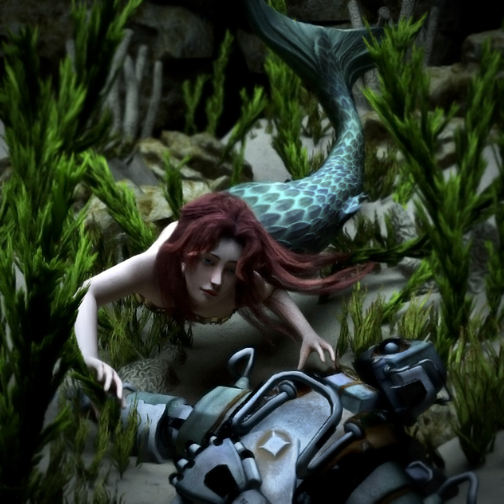
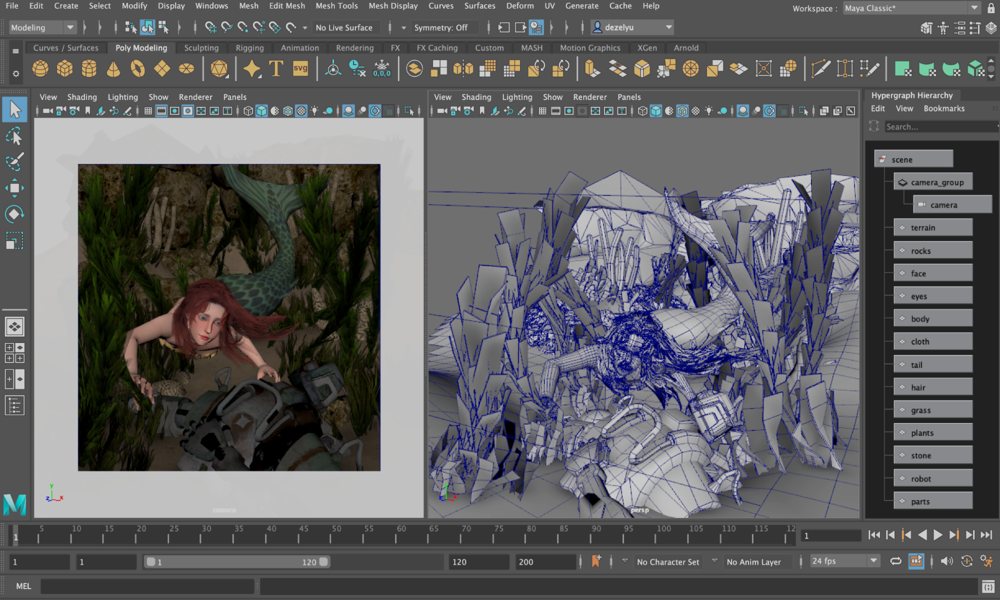
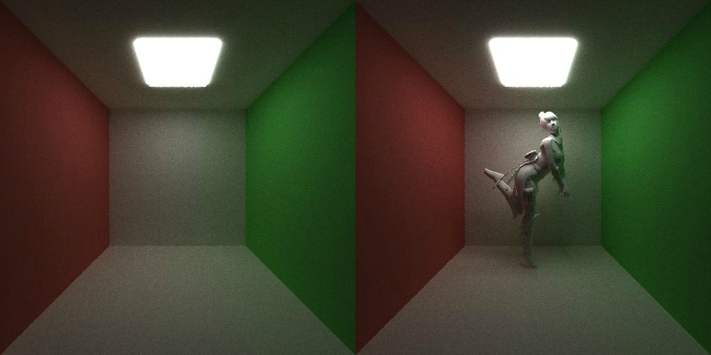
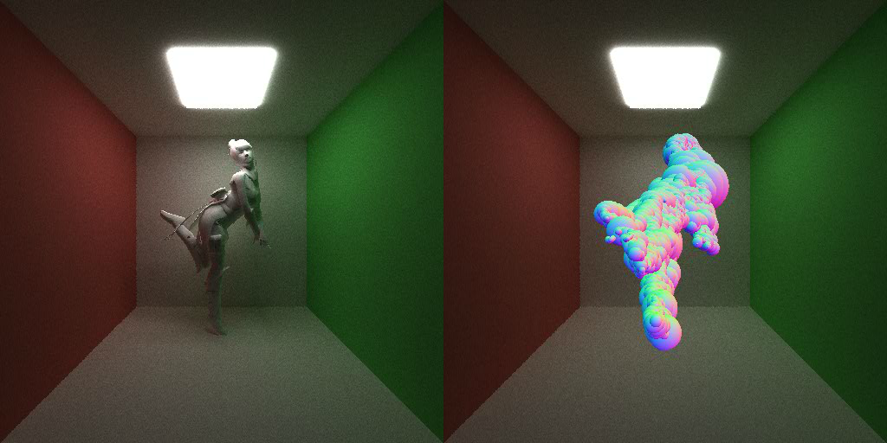
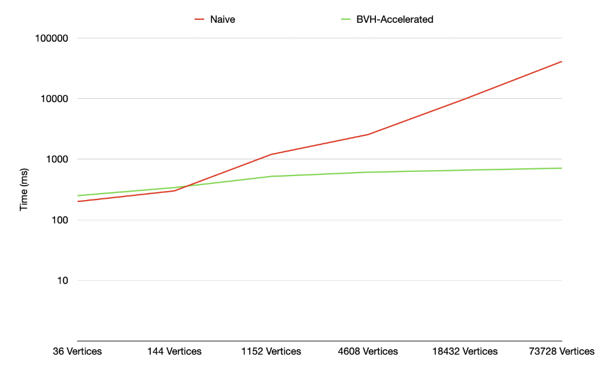
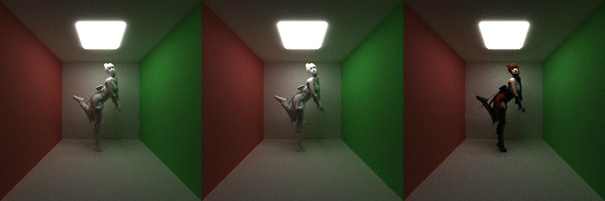
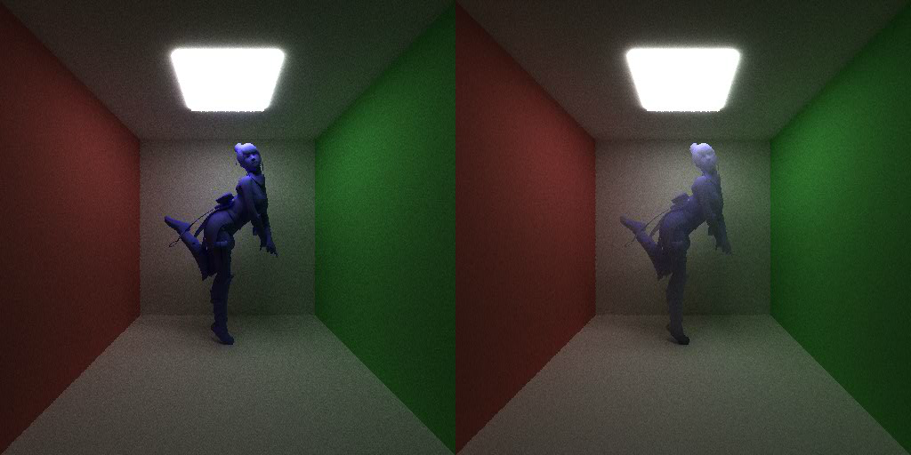

CUDA Path Tracer
================

**University of Pennsylvania, CIS 565: GPU Programming and Architecture, Project 3**

* Deze Lyu
* Developed on: Windows 11, AMD Ryzen 5 5600U @ 2.30GHz 16GB, NVIDIA GeForce MX450 9142MB
* Rendered on: Windows 11, Intel(R) Core(TM) i9-12900F @ 2.40GHz 64GB, NVIDIA GeForce RTX 3090

**Note:** When testing the path tracer with JSON scene files, please provide the full path to the JSON file as the executable argument and ensure that you use forward slashes (`/`) in the file path.

### Deze Lyu

**Final Rendered Image:**

*"Seek of the Forgotten"* by Deze Lyu

**Final Rendered Image Workflow:**

The scene was constructed in **Maya**, utilizing assets sourced from various online asset stores. Each asset was carefully selected and extensively modified to meet the project's unique design requirements, with approximately $200 invested in asset purchases.

The component images generated alongside the final render include diffuse, normal, material type, reflectivity, and bounding sphere volumes. Note that this path tracer utilizes an experimental, self-developed bounding sphere hierarchy as an acceleration structure. In the final image, this is visualized by the surface normals of the bounding spheres, sorted in reverse order.

The final image was rendered with 800 samples per ray and 32 iterations per sample. After rendering, the image was sent to **Photoshop** for denoising and post-processing.

The path tracer supports a range of material types, including purely diffuse, specular materials with roughness, and refractive materials such as glass and water. For rough specular materials, the path tracer employs a cone-based method that interpolates between a perfectly reflected ray and a hemisphere, generating random rays for rough reflections. While this approach is efficient, it may sacrifice some physical accuracy. Refractive materials are physically based and incorporate Fresnel effects, calculated using Schlick's approximation. Additionally, the path tracer supports loading and rendering of OBJ files, along with diffuse and normal mapping. It also handles transparent textures, enabling accurate rendering of complex surfaces like plants and hair.

**Third-Party Libraries:**

This project utilizes **TinyOBJLoader** for loading OBJ model files and **stb_image** for importing texture files. Both libraries are licensed under the MIT License.

**Feature Analysis:**

 - Refractive Material
 - OBJ File Loading
 - BVH Acceleration Structure
 - Diffuse & Normal Texture Mapping
 - Transparent Texture Rendering

#### Refractive Material

This path tracer supports fully refractive materials, modeled based on their index of refraction. The ray direction for refractive surfaces is calculated using **`glm::refract`**, which determines how light bends as it passes through materials like glass or water. To enhance realism, the refraction model incorporates **Fresnel effects**, accounting for the varying degrees of reflection and refraction that occur depending on the angle of incidence. Specifically, **[Schlick’s approximation](https://en.wikipedia.org/wiki/Schlick%27s_approximation)** is employed to efficiently compute these Fresnel effects, providing a balance between performance and accuracy in simulating the interaction of light with refractive surfaces.

The three images above, from left to right, depict spheres rendered with different material models inside a Cornell box. The first image shows a sphere with a non-refractive material. The second image features a sphere with a naive refractive material, where Fresnel reflections are not accounted for. The third image demonstrates a physically accurate refractive material, including Fresnel reflections, which more accurately simulates the behavior of light at varying angles of incidence.

Since physically based refraction involves more computation, it takes slightly longer to render than purely diffuse materials. In a test scene with identical meshes, the rendering time for physically based refraction with Fresnel reflections was approximately 20ms per sample on an NVIDIA GTX 1080, compared to 18ms for purely diffuse materials.

To accelerate refraction with Fresnel effects, **[Schlick’s approximation](https://en.wikipedia.org/wiki/Schlick%27s_approximation)** was chosen as it significantly reduces the computational load compared to exact Fresnel calculations. Schlick’s method is a fast, empirical approximation of the Fresnel equations and avoids costly mathematical operations like exponentiation and division, offering a good balance between performance and realism.

To further optimize this feature, switching to **float16** precision could be considered. Using half-precision floating points would reduce memory usage and improve computation speed, particularly on GPUs that are optimized for lower precision calculations, while still maintaining acceptable visual quality for most scenes.

#### OBJ File Loading

OBJ file loading is primarily a CPU-based feature that allows the path tracer to import model files in the `.obj` format using the **TinyOBJLoader** library. Once all vertices and mesh data from the OBJ file are loaded, they are transferred to a GPU buffer for efficient access during the rendering process.

The two images above compare the scene without and with the custom mesh loaded and rendered.

Rendering custom meshes is generally slower than rendering mathematical primitives, such as spheres and cubes, even when using acceleration structures. This is due to the computational complexity of ray-triangle intersection tests, particularly when dealing with meshes containing a high number of triangles. However, this trade-off is often necessary, as custom meshes allow for greater flexibility and detail in scene creation.

A potential optimization is to implement indexed rendering, which reduces the size of the vertex buffer by introducing an index buffer. This approach minimizes the overhead caused by duplicating vertex data, as common vertices shared between triangles are only stored once, significantly improving memory efficiency and performance during rendering.

#### BVH Acceleration Structure

The **Bounding Volume Hierarchy (BVH)** acceleration structure enables faster traversal of the triangles in the scene by organizing them into a binary tree. This reduces the time complexity of ray-triangle intersection checks from **O(n)** to **O(log n)**. Instead of using the more common axis-aligned bounding boxes (AABB), I experimented with bounding spheres, as ray-sphere intersection tests are generally simpler and potentially more efficient to implement. However, during experimentation, I found that bounding spheres tend to enclose a larger volume than bounding boxes for the same group of triangles, resulting in some performance loss. Despite this, the implementation is fully functional, and the process provided valuable insights.

For the two images above, the image on the left shows the mesh rendered with BVH acceleration enabled, improving traversal speed and performance. The image on the right visualizes the leaf bounding spheres used in the BVH structure, which assist in efficiently searching for ray-triangle intersections.

The graph above shows the rendering time per frame (in milliseconds) as the number of vertices increases, using an NVIDIA MX450 graphics card to highlight more noticeable performance differences. The naive method iterates through all possible triangles for ray-triangle intersection tests, causing the rendering time to increase exponentially, reaching approximately 40,000ms at 73,728 vertices. In contrast, with the BVH acceleration structure, while the initial rendering time may be slightly higher for scenes with fewer vertices, the time increases much more gradually, reaching only about 700ms at the same vertex count.

For potential optimizations, the current bounding sphere generation method splits groups of triangles based on the maximum axis length of the group's bounding box, which can be inefficient depending on the triangle layout. Additionally, since spheres tend to have larger volumes than boxes when wrapping the same group of triangles, rays may unnecessarily test against bounding spheres that could be avoided with bounding boxes. To improve performance, more work could be done during CPU generation. For example, instead of a simple axis-based split, the program could analyze the orientation and density of the triangles to compute minimal bounding spheres with the smallest volumes, while ensuring an even split. Alternatively, switching to bounding boxes may also provide better performance.

On the GPU side, the kernel uses an index array as a stack to traverse the bounding sphere hierarchy. When a bounding sphere is hit by a ray, the kernel checks its children; otherwise, it returns to the parent. For potential optimizations, ray batching can be applied to improve memory coherence and reduce divergence, allowing the GPU to process rays with similar paths more efficiently. Additionally, optimizing memory access patterns and reducing branching in the traversal algorithm could further enhance performance. Switching to a more compact acceleration structure, such as bounding boxes, may also reduce unnecessary intersection tests.

#### Diffuse & Normal Texture Mapping

The path tracer supports diffuse and normal mapping, with textures loaded using the **stb_image** library. Instead of using CUDA's texture memory, the path tracer stores all pixel data in a large GPU buffer and implements its own linear sampling to achieve smooth texture quality.

The three images above display the progression of the character rendering: first, the untextured character, followed by the character with normal mapping applied to add additional details to the skirt and belt, and finally, the fully textured character with both diffuse and normal maps.

Using CUDA's texture memory and sampling would likely result in faster performance. However, since texture arrays are not well supported and I want to avoid imposing a hardcoded texture limit in the path tracer, I opted to implement my own memory management and sampling method.

#### Transparent Texture Rendering

Building on diffuse texture rendering, the path tracer also supports semi-transparent textures, particularly for elements like seaweed and hair in the final rendered image. When a ray intersects a surface with a diffuse texture, the path tracer generates a random decimal between 0 and 1 and compares it to the texture's alpha value. If the random number is smaller, the ray is scattered as it would be for a normal diffuse material. Otherwise, the ray's origin is reset to the intersection point, while its direction remains unchanged.

In the two images above, the left image has transparent texture rendering disabled, which results in black surfaces being preserved in the final rendered image. In contrast, the right image has transparent texture rendering enabled, resulting in realistic rendering of seaweed and hair.

When a scene contains numerous semi-transparent objects, checking all intersected surfaces in a single iteration can significantly reduce performance. To mitigate this, I chose to stop and reset the ray upon striking a semi-transparent surface. This increases the number of iterations required for a sample, allowing the ray to eventually pass through all semi-transparent objects and reach a light source. However, since ray compaction is implemented, the computational load for the final iterations is minimal, ensuring efficient performance.

#### Subsurface Scattering

The path tracer also supports materials with subsurface scattering, which is modeled by simulating the interaction of light with a participating medium, such as skin or marble. In this process, light penetrates the surface, scatters internally, and then re-emerges. My implementation is based on the Exponential Distribution for Mean Free Path, the **[Beer-Lambert Law](https://en.wikipedia.org/wiki/Beer%E2%80%93Lambert_law)**, and Isotropic Scattering.

The two images above display the same model and material with subsurface scattering disabled on the left and enabled on the right.

Enabling subsurface scattering impacts performance when rays interact with the material, as the path tracer performs a loop with 16 iterations during shading to simulate rays bouncing within the material. To optimize performance, this loop does not test whether the ray exits the surface; instead, it keeps track of the total distance traveled and conditionally terminates the ray based on the scattering and absorption coefficients. If the ray remains valid, the path tracer updates the throughput and adjusts the ray's direction to a random orientation within a unit sphere.
