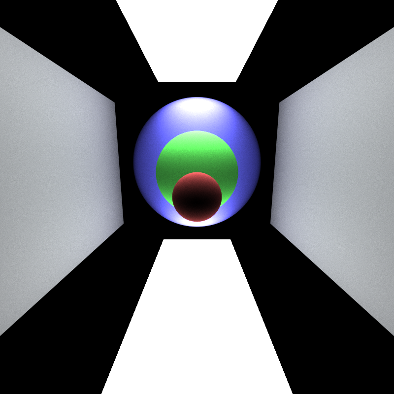
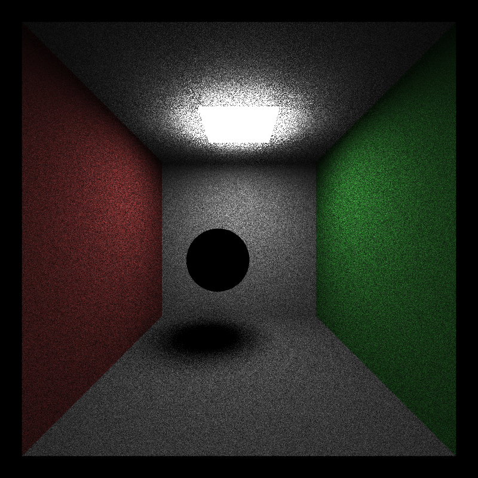

CUDA Path Tracer
================

**University of Pennsylvania, CIS 565: GPU Programming and Architecture, Project 3**
* Nicholas Liu
* [Linkedin](https://www.linkedin.com/in/liunicholas6/)
* Tested on: Linux Mint 22 Wilma, AMD Ryzen 7 5800X @ 2.512GHz, 32GB RAM, GeForce GTX 1660 Ti

### Background
This project is a path tracer, written in CUDA. It functions by physically simulating the paths of light rays in a scene in order to render objects. For each pixel, many simulated light rays are fired from the camera. The rays intersection with geometry is calculated, bounced probabalistically in a direction dependent on the material hit, and picks up color from the surface hit.

Note that rays are fired from the camera instead of from light sources, as the vast majority of actual photons emitted from an arbitrary light source would not hit the camera and would be wasted computation -- hence tracing the paths in reverse.

### Features
## Material surfaces
The project currently features 4 different types of surfaces: diffuse, reflective, transmissive, and glassy.

Diffuse surfaces disperses light equally in all directions, and give a flat color.

Reflective and transmissive surfaces disperse rays in one particular output direction for a given input direction, following the laws of reflectance and Snell's laws respectively. Reflective surfaces appear as mirrors, while transmissive are see-through with some distortion.

Finally, glassy surfaces reflect some light rays and transmit others, with probability dependent on the incident angle of the incoming light ray.

A glossy reflection

## Depth of field
A thin-lens approximation of a camera is used to generate depth of field, which blurs out objects depending on how close they are to a focal plane a set distance from the camera. 

## Direct Lighting
Many rays in the path tracing algorithm will miss light sources. The more rays miss their light sources, the longer it takes for the final image to converge. Another rendering technique, direct lighting, can yield a faster convergence time -- it works by, instead of scattering a ray randomly, picking an arbitrary point on a light source and scattering it in said direction.

Direct lighting notably does not yield correct-looking results for reflective and transmissive materials, but generally gives a usable image faster, especially in cases with small light sources.

The following show a 20 sample image with regular lighting and direct lighting compared and a fairly normal-sized light source

The code for direct lighting also lays the groundwork for multiple importance sampling, which functions well in both the scenarios that naive and direct lighting path tracing methods work well for -- I'll be sure to come back to this project with some materials and scenes where direct lighting really shines!

## GLTF loading and texturing
To be able to render more visually interesting scenes without hand-specifying them through code, loading of arbitrary mesh data is supported. Materials that utilize textures for their albedo and emmission maps are supported as well, in order to allow for geometry that isn't just uniform in color.

